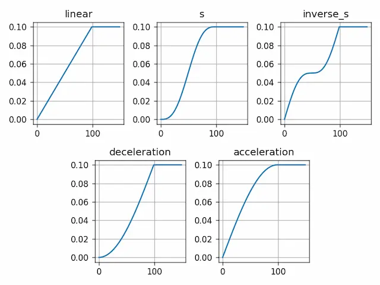

# SARNN {#model_overview}

SARNN "explicitly" extracts the spatial coordinates of critical positions in the task, such as target objects and arms, from images, and learns the coordinates along with the robot's joint angles of the robot[@ichiwara2022contact]. This greatly improves robustness to changes in the object's position. The figure below illustrates the network structure of SARNN, which consists of an encoder responsible for extracting image features $f_t$ and object position coordinates $p_t$ from camera images $i_t$, a recurrent module that learns the temporal changes in the robot's joint angles and object position coordinates $p_t$, and a decoder that reconstructs images based on the image features $f_t$ and heat maps $\hat h_{t+1}$.

The upper part of the encoder and decoder consists of CNN layers, including Convolutional and Transposed Convolutional layers, which extract and reconstruct color and shape information of objects from image features. The lower part of the CNN uses the Spatial Softmax layer to extract 2D position information of objects. The Recurrent module only predicts the position information $p_{t+1}$ of the object, which alone is not sufficient to reconstruct the image using the decoder. Therefore, a heat map $\hat h_{t+1}$ centered on the predicted coordinate information $p_{t+1}$ is generated. By multiplying it with the image features extracted by the CNN in the upper part, a predicted image $\hat i_{t+1}$ is generated based on the information around the predicted attention point.

Here, we show the implementation method and model classes for the distinctive features of SARNN: [Spatial Attention Mechanism](#spatial_softmax), [Heatmap Generator](#heatmap), [Loss Scheduler](#loss_scheduler), and [Backpropagation Through Time](#bptt).

{: .center}


<!-- #################################################################################################### -->
----
## Spatial Attention Mechanism  {#spatial_softmax}
The spatial attention mechanism emphasizes important information (pixels with large values) by multiplying the feature map by softmax. It then extracts the position information of the highlighted pixels using position encoding. The figure below illustrates the results of the spatial attention mechanism, where important position information (represented by red dots) is extracted by multiplying a "pseudo" feature map generated by two randomly generated Gaussian distributions with Softmax. Since CNN feature maps contain diverse information, they are not effectively enhanced by a simple softmax multiplication. To further enhance the features, it is critical to use [Softmax with temperature](https://en.wikipedia.org/wiki/Softmax_function). The effect of Softmax with temperature can be observed by adjusting the `temperature` parameter in the provided example program. The red dots in the figure indicate the positions extracted by spatial Softmax, and since they are generated at the center of one of the Gaussian distributions, the position information can be extracted accurately.


{: .center}

```python title="<a href=https://github.com/ogata-lab/eipl/blob/master/eipl/layer/SpatialSoftmax.py>[SOURCE] SpatialSoftmax.py</a>" linenums="1"
class SpatialSoftmax(nn.Module):
    def __init__(self, width: int, height: int, temperature=1e-4, normalized=True):
        super(SpatialSoftmax, self).__init__()
        self.width = width
        self.height = height
        if temperature is None:
            self.temperature = torch.nn.Parameter(torch.ones(1))
        else:
            self.temperature = temperature

        _, pos_x, pos_y = create_position_encoding(width, height, normalized=normalized)
        self.register_buffer("pos_x", pos_x)
        self.register_buffer("pos_y", pos_y)

    def forward(self, x):
        batch_size, channels, width, height = x.shape
        assert height == self.height
        assert width == self.width

        # flatten, apply softmax
        logit = x.reshape(batch_size, channels, -1)
        att_map = torch.softmax(logit / self.temperature, dim=-1)

        # compute expectation
        expected_x = torch.sum(self.pos_x * att_map, dim=-1, keepdim=True)
        expected_y = torch.sum(self.pos_y * att_map, dim=-1, keepdim=True)
        keys = torch.cat([expected_x, expected_y], -1)

        # keys [[x,y], [x,y], [x,y],...]
        keys = keys.reshape(batch_size, channels, 2)
        att_map = att_map.reshape(-1, channels, width, height)
        return keys, att_map
```


<!-- #################################################################################################### -->
----
## Heatmap Generator {#heatmap}
The Heatmap Generator generates a heatmap centered on specific pixel coordinates that represent the position information. The figure below illustrates a heatmap generated by the heatmap generator, centered on the position extracted by the spatial attention mechanism (indicated by the red dot in the figure). The size of the heatmap can be adjusted using the `heatmap_size` parameter. A smaller heatmap size considers only the information near the attention point, while a larger size includes some surrounding information in the generated image. It is important to note that if the heatmap is too small, the corresponding predictive image $\hat i_{t+1}$ may not be generated, while if it is too large, adjustments to the sensitivity parameter may be required to account for changes in the environment, such as background and obstacles.


{: .center}


```python title="<a href=https://github.com/ogata-lab/eipl/blob/master/eipl/layer/SpatialSoftmax.py>[SOURCE] InverseSpatialSoftmax.py</a>" linenums="1"
class InverseSpatialSoftmax(nn.Module):
    def __init__(self, width: int, height: int, heatmap_size=0.1, normalized=True):
        super(InverseSpatialSoftmax, self).__init__()

        self.width = width
        self.height = height
        self.normalized = normalized
        self.heatmap_size = heatmap_size

        pos_xy, _, _ = create_position_encoding(width, height, normalized=normalized)
        self.register_buffer("pos_xy", pos_xy)

    def forward(self, keys):
        squared_distances = torch.sum(
            torch.pow(self.pos_xy[None, None] - keys[:, :, :, None, None], 2.0), axis=2
        )
        heatmap = torch.exp(-squared_distances / self.heatmap_size)
        return heatmap
```


<!-- #################################################################################################### -->
----
## Loss Scheduler {#loss_scheduler} 
The loss scheduler is a `callback` function that gradually assigns weights to the prediction error of the attention point based on the number of epochs. It is an important feature for SARNN training. The figure below shows the weighting curve for each `curve_name` argument, where the horizontal axis represents the number of epochs and the vertical axis represents the weighting value. The decay weighting starts at 0 and gradually reaches the maximum weighting value (e.g. 0.1) at the epoch specified by `decay_end` (e.g. 100). It is important to note that the maximum weighting value is determined by the `__call__` method. This class supports five types of curves, as shown in the figure: linear, S-curve, inverse S-curve, decay, and acceleration interpolation.

{: .center}


The reason for using the error scheduler in SARNN training is to allow the CNN filters to be trained more freely in the early stages. Since the encoder and decoder weights of SARNN are randomly initialized, visual features may not be correctly extracted or learned during the initial learning phase.

When the prediction error of attention obtained in such a situation is backpropagated, the attention point may not be correctly directed to the work object. Instead, the attention point that minimizes the "prediction image error" is learned. Therefore, by ignoring the prediction error of the attention point at the initial stage of learning, it is possible to obtain an attention point that focuses only on the work object. The attention point prediction error is then learned when the CNN filters have finished learning features. The `decay_end` parameter sets the learning time of the CNN, which is typically set to about 1000 epochs, but may need to be adjusted depending on the task.


```python title="<a href=https://github.com/ogata-lab/eipl/blob/master/eipl/utils/callback.py>[SOURCE] callback.py</a>" linenums="1"
class LossScheduler:
    def __init__(self, decay_end=1000, curve_name="s"):
        decay_start = 0
        self.counter = -1
        self.decay_end = decay_end
        self.interpolated_values = self.curve_interpolation(
            decay_start, decay_end, decay_end, curve_name
        )

    def linear_interpolation(self, start, end, num_points):
        x = np.linspace(start, end, num_points)
        return x

    def s_curve_interpolation(self, start, end, num_points):
        t = np.linspace(0, 1, num_points)
        x = start + (end - start) * (t - np.sin(2 * np.pi * t) / (2 * np.pi))
        return x

    def inverse_s_curve_interpolation(self, start, end, num_points):
        t = np.linspace(0, 1, num_points)
        x = start + (end - start) * (t + np.sin(2 * np.pi * t) / (2 * np.pi))
        return x

    def deceleration_curve_interpolation(self, start, end, num_points):
        t = np.linspace(0, 1, num_points)
        x = start + (end - start) * (1 - np.cos(np.pi * t / 2))
        return x

    def acceleration_curve_interpolation(self, start, end, num_points):
        t = np.linspace(0, 1, num_points)
        x = start + (end - start) * (np.sin(np.pi * t / 2))
        return x

    def curve_interpolation(self, start, end, num_points, curve_name):
        if curve_name == "linear":
            interpolated_values = self.linear_interpolation(start, end, num_points)
        elif curve_name == "s":
            interpolated_values = self.s_curve_interpolation(start, end, num_points)
        elif curve_name == "inverse_s":
            interpolated_values = self.inverse_s_curve_interpolation(start, end, num_points)
        elif curve_name == "deceleration":
            interpolated_values = self.deceleration_curve_interpolation(start, end, num_points)
        elif curve_name == "acceleration":
            interpolated_values = self.acceleration_curve_interpolation(start, end, num_points)
        else:
            assert False, "Invalid curve name. {}".format(curve_name)

        return interpolated_values / num_points

    def __call__(self, loss_weight):
        self.counter += 1
        if self.counter >= self.decay_end:
            return loss_weight
        else:
            return self.interpolated_values[self.counter] * loss_weight
```


<!-- #################################################################################################### -->
----
## Backpropagation Through Time {#bptt}
We use Backpropagation Through Time (BPTT) to learn the time series of the model[@rumelhart1986learning]. In an RNN, the internal state $h_{t}$ at each time step depends on the internal state $h_{t-1}$ at the previous time step $t-1$. In BPTT, the parameters are updated at each time step by calculating the loss at each time step and then calculating the gradients backwards. Specifically, the model takes input images $i_t$ and joint angles $a_{t}$ and outputs the next state ($\hat i_{t+1}$, $\hat a_{t+1}$). The mean squared error (MSE) loss between the predictions and the true values ($f_{t+1}$, $a_{t+1}$) for all sequences is computed using `nn.MSELoss`, and error propagation is performed based on the `loss` value. Since the parameters at each time step are used for all subsequent time steps, backpropagation is performed with temporal expansion.

Lines 47-54 show that SARNN calculates not only the image loss and the joint angle loss, but also the prediction loss of the attention point. Since the true value of the attention point is not available, the bidirectional loss [@hiruma2022deep] is used to learn the attention point. Specifically, the model updates the weights to minimize the loss between the attention point $\hat p_{t+1}$ predicted by the RNN at each time step and the attention point $p_{t+1}$ extracted by the CNN at the same time step $t+1$. Based on this bidirectional loss, the LSTM learns the time-series relationship between attention points and joint angles. This approach not only eliminates redundant image predictions, but also encourages the CNN to predict attention points that are critical for motion prediction.

In addition, `loss_weights` assign weights to each modality loss, thus determining the focus of learning for each modality. In deep predictive learning, joint angles are learned intensively because they directly affect the robot's motion commands. However, if the image information is not adequately learned, the integration of image and joint angle learning may not occur properly, making joint angle prediction corresponding to the image information difficult. Therefore, the weighting coefficients need to be adjusted based on the model and the task. In our experience, the weighting factor is often set to 1.0 for all modalities or 0.1 for images only.


```python title="<a href=https://github.com/ogata-lab/eipl/blob/master/eipl/tutorials/sarnn/libs/fullBPTT.py>[SOURCE] fullBPTT.py</a>" linenums="1" hl_lines="6 47-54"
class fullBPTTtrainer:
    def __init__(self, model, optimizer, loss_weights=[1.0, 1.0], device="cpu"):
        self.device = device
        self.optimizer = optimizer
        self.loss_weights = loss_weights
        self.scheduler = LossScheduler(decay_end=1000, curve_name="s")
        self.model = model.to(self.device)

    def save(self, epoch, loss, savename):
        torch.save(
            {
                "epoch": epoch,
                "model_state_dict": self.model.state_dict(),
                "train_loss": loss[0],
                "test_loss": loss[1],
            },
            savename,
        )

    def process_epoch(self, data, training=True):
        if not training:
            self.model.eval()

        total_loss = 0.0
        for n_batch, ((x_img, x_joint), (y_img, y_joint)) in enumerate(data):
            x_img = x_img.to(self.device)
            y_img = y_img.to(self.device)
            x_joint = x_joint.to(self.device)
            y_joint = y_joint.to(self.device)

            state = None
            yi_list, yv_list = [], []
            dec_pts_list, enc_pts_list = [], []
            T = x_img.shape[1]
            for t in range(T - 1):
                _yi_hat, _yv_hat, enc_ij, dec_ij, state = self.model(
                    x_img[:, t], x_joint[:, t], state
                )
                yi_list.append(_yi_hat)
                yv_list.append(_yv_hat)
                enc_pts_list.append(enc_ij)
                dec_pts_list.append(dec_ij)

            yi_hat = torch.permute(torch.stack(yi_list), (1, 0, 2, 3, 4))
            yv_hat = torch.permute(torch.stack(yv_list), (1, 0, 2))

            img_loss = nn.MSELoss()(yi_hat, y_img[:, 1:]) * self.loss_weights[0]
            joint_loss = nn.MSELoss()(yv_hat, y_joint[:, 1:]) * self.loss_weights[1]
            # Gradually change the loss value using the LossScheluder class.
            pt_loss = nn.MSELoss()(
                torch.stack(dec_pts_list[:-1]), torch.stack(enc_pts_list[1:])
            ) * self.scheduler(self.loss_weights[2])
            loss = img_loss + joint_loss + pt_loss
            total_loss += loss.item()

            if training:
                self.optimizer.zero_grad(set_to_none=True)
                loss.backward()
                self.optimizer.step()

        return total_loss / (n_batch + 1)
```


<!-- #################################################################################################### -->
---- 
::: model.SARNN
    handler: python
    options:
      show_root_heading: true
      show_source: true
