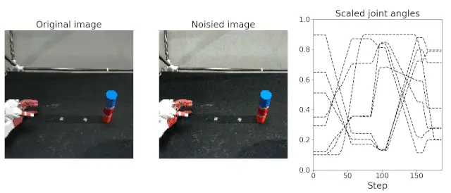

EIPL provides a `MultimodalDataset` class for learning robot motions, which inherits from the `Dataset` class provided by Pytorch as standard.
This class returns every epoch, a pair of input data `x_data` and a true value `y_data`.
The input data `x_data` is a pair of images and joint angles, and data augmentation is applied every epoch.
The input image is randomly assigned brightness, contrast, etc. to improve robustness against lighting changes, and the input joint angles are added gaussian noise to improve robustness against position errors.
On the other hand, no noise is added to the true data.
The model learns a noise-neglected situation (internal representation) from input data mixed with noise, which enables robust motion generation against real-world noise during inference.

The following source code shows how to use the `MultimodalDataset` class using an [object grasping task](../teach/overview.md) collected using AIREC as an example.
By passing 5-dimensional image time-series data [number of data, time-series length, channel, height, width] and
3-dimensional joint angle time-series data [number of data, time-series length, number of joints] to the `MultimodalDataset` class, data expansion and other operations are automatically performed. Note that `SampleDownloader` downloading sample dataset and is not necessarily required.
You may use the `numpy.load` function or other functions to directly load your own data sets.

```python title="How to use dataloader" linenums="1"
from eipl.data import SampleDownloader, MultimodalDataset

# Download and normalize sample data
grasp_data = SampleDownloader("airec", "grasp_bottle", img_format="CHW")
images, joints = grasp_data.load_norm_data("train", vmin=0.1, vmax=0.9)

# Give the image and joint angles to the Dataset class
multi_dataset = MultimodalDataset(images, joints)

# Return input/true data as return value.
x_data, y_data = multi_dataset[1]
```

The following figure shows the robot camera images returned by the `MultimodalDataset` class, From left to right are the noiseless image, the image with noise and the robot joint angles. Since random noise is added to the image every epoch, the model learns a wide variety of visual situations. The black dotted lines in the robot joint angles are the original joint angles without noise, and the colored lines are the joint angles with gaussian noise.


{: .center}


!!! note
    
    If you are unable to get the dataset due to a proxy or some other reason, download the data set manually from [here](https://dl.dropboxusercontent.com/s/5gz1j4uzpzhnttt/grasp_bottle.tar) and save it in the ~/.eipl/ folder.
        ```bash            
        $ cd ~/
        $ mkdir .eipl
        $ cd .eipl
        $ # copy grasp_bottle.tar to ~/.eipl/ directory
        $ tar xvf grasp_bottle.tar
        $ ls grasp_bottle/*
        grasp_bottle/joint_bounds.npy
        ```


<!-- #################################################################################################### -->
---- 
::: dataloader.MultimodalDataset
    handler: python
    options:
      show_root_heading: true
      show_source: true
