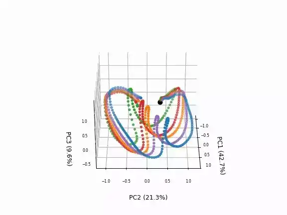

# Inference {#test}
<!-- #################################################################################################### -->
## Offline inference 
To verify that SARNN has been trained correctly, use the test program `test.py`. The argument `filename` should be the path of the trained weights file, and `idx` is the index of the data to be visualized. The input_param is a mixing coefficient that produces stable behavior against real-world noise. It mixes the sensor information at a given time with the model predictions at the previous time $t-1$ in a certain ratio and feeds it as input to the model. This process can be seen as a low-pass filter, where the predicted values from the previous time can complement the prediction of stable motion commands, even if the robot's sensor values are noisy. It is important to note that if the mixing coefficient is too small, it becomes difficult to adjust the motion based on real sensor information, and the robustness to position changes decreases.


```bash
$ cd eipl/tutorials/sarnn/
$ python3 ./bin/test.py --filename ./log/20230521_1247_41/SARNN.pth --idx 4 --input_param 1.0

images shape:(187, 128, 128, 3), min=0, max=255
joints shape:(187, 8), min=-0.8595600128173828, max=1.8292399644851685
loop_ct:0, joint:[ 0.00226304 -0.7357931  -0.28175825  1.2895856   0.7252841   0.14539993
-0.0266939   0.00422328]
loop_ct:1, joint:[ 0.00307412 -0.73363686 -0.2815826   1.2874944   0.72176594  0.1542334
-0.02719587  0.00325996]
.
.
.

$ ls output/
SARNN_20230521_1247_41_4_1.0.gif
```
The following figure shows the inference results at an untaught position ([point D](../teach/overview.md#task)). From left to right are the input image, the predicted image, and the predicted joint angles (dotted lines represent the true values). The blue points in the input image represent the POIs (Point of Interest) extracted from the image, while the red points represent the POIs predicted by the RNN. This indicates that the joint angle is predicted while focusing on the robot hand and the grasped object.

{: .center}


<!-- #################################################################################################### -->
----
## Principal Component Analysis {#pca}
In deep predictive learning, it is recommended to visualize the internal representation using Principal Component Analysis (PCA)[@hotelling1933analysis] to preliminarily examine the generalization performance of the trained model. By embedding motion into the internal state of the RNN and ensuring that the internal state is self-organized and structured for each learning motion, we can achieve generalization motion with a small amount of data. To verify how the sensorimotor information (images and joint angles) is represented, we use PCA to compress the internal state of the RNN into a lower dimension and visualize the elements that represent the characteristics of the data, specifically the first through third principal components.

The following code snippet demonstrates the inference and PCA process. First, the test data is fed into the model and the internal state `state` of the RNN at each time step is stored as a list. In the case of [LSTM](https://pytorch.org/docs/stable/generated/torch.nn.LSTM.html), the `hidden state` and the `cell state` are returned as `state`. For visualization and analysis purposes we use the `hidden state`. Next, we reshape the state from [number of data, time series length, number of state dimensions] to [number of data x time series length, number of state dimensions] to compare the internal state at each object position. Finally, we apply PCA to compress the high-dimensional state into low-dimensional information (3 dimensions), as shown in line 12. By restoring the compressed principal component pca_val to its original form [number of data, time series length, 3 dim], we can visualize the relationship between object position and internal state by assigning a unique color to each object position and plotting the points in 3D space.


```python title="<a href=https://github.com/ogata-lab/eipl/blob/master/eipl/tutorials/sarnn/bin/test_pca_sarnn.py>[SOURCE] test_pca_rnn.py</a>" linenums="1" hl_lines="12"
states = tensor2numpy( states )
# Reshape the state from [N,T,D] to [-1,D] for PCA of RNN.
# N is the number of datasets
# T is the sequence length
# D is the dimension of the hidden state
N,T,D  = states.shape
states = states.reshape(-1,D)

# plot pca
loop_ct = float(360)/T
pca_dim = 3
pca     = PCA(n_components=pca_dim).fit(states)
pca_val = pca.transform(states)
# Reshape the states from [-1, pca_dim] to [N,T,pca_dim] to
# visualize each state as a 3D scatter.
pca_val = pca_val.reshape( N, T, pca_dim )

fig = plt.figure(dpi=60)
ax = fig.add_subplot(projection='3d')

def anim_update(i):
    ax.cla()
    angle = int(loop_ct * i)
    ax.view_init(30, angle)

    c_list = ['C0','C1','C2','C3','C4']
```

Use the `test_pca_sarnn.py` program to visualize the internal state using PCA. The filename argument should be the path to the weight file.

```bash
$ cd eipl/tutorials/sarnn/
$ python3 ./bin/test_pca_sarnn.py --filename log/20230521_1247_41/SARNN.pth
$ ls output/
PCA_SARNN_20230521_1247_41.gif
```

The figure below shows the inference results of SARNN. Each dotted line represents the time evolution of the internal state. The color of each attractor corresponds to the [object position](../teach/overview.md#task): blue, orange, and green correspond to the teaching positions A, C, and E, while red and purple correspond to the untrained positions B and D. The self-organization of the attractors based on the object position indicates that the behavior is learned and memorized according to the object position. In particular, the attractors at the untrained positions are generated between the teaching positions, allowing the generation of interpolated movements by teaching grasping movements with different object positions multiple times.

{: .center}


<!-- #################################################################################################### -->
----
## Motion Generation {#online}
The following pseudocode describes an online motion generation method using a real robot. The robot can generate sequential motions based on sensor information by repeating steps 2-5 at a specified sampling rate.

1. **Load model (line 23)**

    After defining the model, load the trained weights.


2. **Retrieve and normalize sensor information (line 38)**

    Retrieve the robot's sensor information and perform the normalization process. For example, if you are using ROS, subscribe to the image and joint angles and assign them to the `raw_image` and `raw_joint` variables.
    

3. **Inference (line 51)**

    Predict the image `y_image` and joint angle `y_joint` for the next time step using the normalized image `x_img` and joint angle `x_joint`.
    

4. **Send command (line 61)**

    By using the predicted joint angle `pred_joint` as the robot's motor command, the robot can generate sequential motions. When using ROS, publish the joint angles to the motors to control each motor based on the motor command.

5. **Sleep (line 65)**

    Finally, insert a sleep process to adjust the timing and perform inference at the specified sampling rate. The sampling rate should be the same as that used during training data collection.


```python title="online.py" linenums="1" hl_lines="23-26 38-44 51-52 61-63 65-67"
parser = argparse.ArgumentParser()
parser.add_argument("--model_pth", type=str, default=None)
parser.add_argument("--input_param", type=float, default=0.8)
args = parser.parse_args()

# restore parameters
dir_name = os.path.split(args.model_pth)[0]
params = restore_args(os.path.join(dir_name, "args.json"))

# load dataset
minmax = [params["vmin"], params["vmax"]]
joint_bounds = np.load(os.path.join(os.path.expanduser("~"), ".eipl/grasp_bottle/joint_bounds.npy"))

# define model
model = SARNN(
    rec_dim=params["rec_dim"],
    joint_dim=8,
    k_dim=params["k_dim"],
    heatmap_size=params["heatmap_size"],
    temperature=params["temperature"],
)

# load weight
ckpt = torch.load(args.model_pth, map_location=torch.device("cpu"))
model.load_state_dict(ckpt["model_state_dict"])
model.eval()

# Inference
# Set the inference frequency; for a 10-Hz in ROS system, set as follows.
freq = 10  # 10Hz
rate = rospy.Rate(freq)
image_list, joint_list = [], []
state = None
nloop = 200  # freq * 20 sec
for loop_ct in range(nloop):
    start_time = time.time()

    # load data and normalization
    raw_images, raw_joint = robot.get_sensor_data()
    x_img = raw_images[loop_ct].transpose(2, 0, 1)
    x_img = torch.Tensor(np.expand_dims(x_img, 0))
    x_img = normalization(x_img, (0, 255), minmax)
    x_joint = torch.Tensor(np.expand_dims(raw_joint, 0))
    x_joint = normalization(x_joint, joint_bounds, minmax)

    # closed loop
    if loop_ct > 0:
        x_img = args.input_param * x_img + (1.0 - args.input_param) * y_image
        x_joint = args.input_param * x_joint + (1.0 - args.input_param) * y_joint

    # predict rnn
    y_image, y_joint, state = rnn_model(x_img, x_joint, state)

    # denormalization
    pred_image = tensor2numpy(y_image[0])
    pred_image = deprocess_img(pred_image, cae_params["vmin"], cae_params["vmax"])
    pred_image = pred_image.transpose(1, 2, 0)
    pred_joint = tensor2numpy(y_joint[0])
    pred_joint = normalization(pred_joint, minmax, joint_bounds)

    # send pred_joint to robot
    # send_command(pred_joint)
    pub.publish(pred_joint)

    # Sleep to infer at set frequency.
    # ROS system
    rate.sleep()
```
