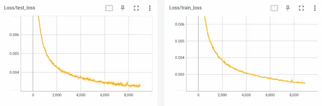

## Files
Use the programs in the [tutorial/SARNN](https://github.com/ogata-lab/eipl/tree/master/eipl/tutorials/sarnn) folder in the EIPL repository for training SARNN.
The roles of each folder and program are as follows:

- **bin/train.py**: Programs to load data, train, and save models.
- **bin/test.py**: Program to perform off-line inference of models using test data (images and joint angles) and visualize inference results.
- **bin/test_pca_sarnn.py**: Program to visualize the internal state of RNN using Principal Component Analysis.
- **libs/fullBPTT.py**: Back propagation class for time series learning.
- **log**: Folder to store weights, learning curves, and parameter information.
- **output**: Save inference results.


<!-- #################################################################################################### -->
----
## Trainig {#train}
The main program `train.py` is used to train SARNN.
When the program is run, the weights (pth) and Tensorboard log files are saved in the `log` folder.
The program allows the user to specify the necessary parameters for training, such as model type, number of epochs, batch size, training rate, and optimization method, using command line arguments.
It also uses the EarlyStopping library to determine when to terminate training early as well as to save weights when the test error is minimized.
For a detailed description of how the program works, please [see](https://github.com/ogata-lab/eipl/blob/master/eipl/tutorials/sarnn/bin/train.py) the comments in the code.


```bash 
$ cd eipl/tutorials/sarnn/
$ python3 ./bin/train.py
[INFO] Set tag = "20230521_1247_41"
================================
batch_size : 5
device : 0
epoch : 100000
heatmap_size : 0.1
img_loss : 0.1
joint_loss : 1.0
k_dim : 5
log_dir : log/
lr : 0.001
model : sarnn
optimizer : adam
pt_loss : 0.1
rec_dim : 50
stdev : 0.02
tag : "20230521_1247_41"
temperature : 0.0001
vmax : 1.0
vmin : 0.0
================================
12%|████          | 11504/100000 [14:46:53<114:10:44,  4.64s/it, train_loss=0.000251, test_loss=0.000316]
```


<!-- #################################################################################################### -->
----
## Learning Curves {#tensorboard}
Check the training status of the model using TensorBoard.
By specifying the log folder where the weights are stored in the argument `logdir`, you can see the learning curve in your browser as shown in the figure below.
If there is a tendency toward over-learning in the early phase of training, it may be due to an anomaly in the training data or model, or the initial weights (seeds).
Countermeasures include checking the normalization range of the training data, checking the model structure, and retraining with different seed values.
For specific information on how to use TensorBoard, please refer to [here](https://www.tensorflow.org/tensorboard).


```bash
$ cd eipl/tutorials/sarnn/
$ tensorboard --logdir=./log/
TensorFlow installation not found - running with reduced feature set.
Serving TensorBoard on localhost; to expose to the network, use a proxy or pass --bind_all
TensorBoard 2.12.1 at http://localhost:6006/ (Press CTRL+C to quit)
```

{: .center}

