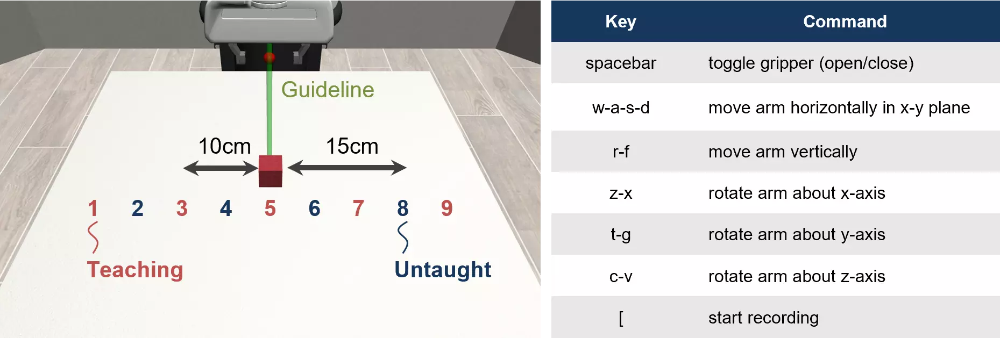
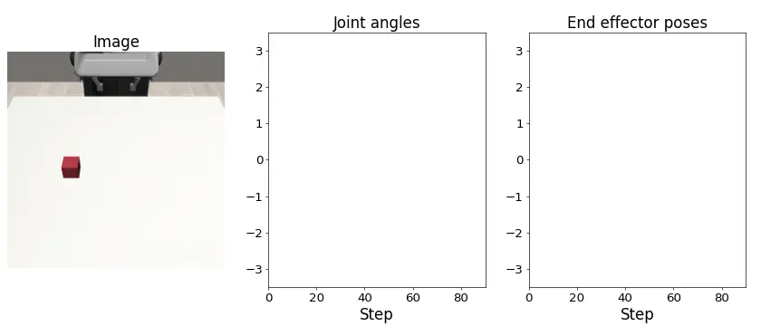
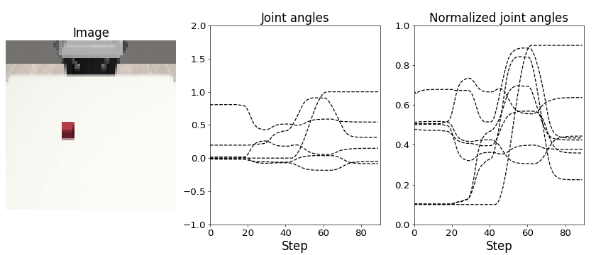

# Motion Teaching

Here we describe a sequence of procedures from motion teaching to motion generation using robot simulator [Robosuite](https://robosuite.ai/). 


<!-- ******************************** -->
----
## Setup

Clone the robosuite repository
```bash linenums="1"
$ git clone https://github.com/ARISE-Initiative/robosuite.git
$ cd robosuite
```

Install the requirements with
```bash linenums="1"
$ pip3 install -r requirements.txt
$ pip3 install -r requirements-extra.txt
```


<!-- ******************************** -->
----
## Teleoperation
Teach object grasping motions to the robot using keyboard teleoperation. The following figure shows an overview of this experimental task, in which the robot grasps a red cube. The red letters in the figure are the teaching positions and the blue letters are the untaught positions, and the position of the grasping object was shifted by 5 cm intervals. The robot is moved up, down, left, and right with reference to the commands in the table. To facilitate learning the relationship between the position of the grasping object and the motion, a slight offset is applied to the position of the object each time. In this experiment, five grasping motions were taught at each position.

{: .center}


The following is a description of how to use the motion teaching program (1_teaching.py).
The argument `pos` is the position of the object, and `ep_dir` is the save directory.
We provide a `demonstration dataset` to eliminate the hassle of data collection. For more information, [click here](#demonstration-dataset).


```bash linenums="1" 
$ cd eipl/tutorials/robosuite/simulator
$ ls
2_resave.sh  3_check_data.sh  bin  data  libs  output  README
$ python3 ./bin/1_teaching.py --pos target_position --ep_dir save_dir

# e.g.
$ python3 ./bin/1_teaching.py --pos -0.2 --ep_dir ./data/raw_data/Pos1_1

[robosuite WARNING] No private macro file found! (__init__.py:7)
[robosuite WARNING] It is recommended to use a private macro file (__init__.py:8)
[robosuite WARNING] To setup, run: python /home/ito/Downloads/robosuite/robosuite/scripts/setup_macros.py (__init__.py:9)

Keys      	Command
spacebar  	toggle gripper (open/close)
w-a-s-d   	move arm horizontally in x-y plane
r-f       	move arm vertically
z-x       	rotate arm about x-axis
t-g       	rotate arm about y-axis
c-v       	rotate arm about z-axis
[         	start recording
]         	stop recording (not recommended)

Collecting demonstration data ...
```

The collected data (model.xml and state.npz) are stored in the `ep_dir` folder (e.g. ./data/raw_data/).
```bash linenums="1"
$ ls ./data/raw_data/
Pos1_1  Pos1_2  Pos1_3  Pos1_4  Pos2_1  Pos2_2  Pos2_3  Pos2_4 ...
$ cd ./data/raw_data/Pos1_1
model.xml  state.npz
```


<!-- ******************************** -->
----
## Data Re-Saving
The following two processes are performed.
The first is the removal of guide lines. During keyboard teleoperation, green guide lines appear in the image data. By playback of the collected data, the image data without the guide line is saved. The second is downsampling. During tele-operation, the collected data sequence is long (default is 600 step) because the robot is controlled with a high frequency to teach fine movements. Therefore, sensor data is recollected every 5 step to downsample the sequence length to 120 step.

```bash linenums="1"
# Re-save the files one by one.
$ python3 ./bin/2_resave.py --ep_dir ./data/raw_data/Pos1_1/

# Re-save all files in the specified folder (default is './data/raw_data')  at once.
$ bash 2_resave.sh
```

Check whether the motion generated by playback is correct. Tasks rarely fail due to downsampling. If the playback data fails the task, the following error is displayed `[ERROR] This data set has failed task during playback.`. If the task is successful, the gif animation is saved in the output folder.

```bash linenums="1"
# Re-save the files one by one.
$ python3 ./bin/3_check_playback_data.py ./data/raw_data/Pos1_1/state_resave.npz
$ ls ./output/
Pos1_1_image_joint_ani.gif

# Re-save all files in the specified folder (default is './data/raw_data')  at once.
$ bash 3_check_data.sh
```

{: .center}


<!-- ******************************** -->
----
## Generate Dataset
If the playbacked file was stored in `./data/raw_data/`, training/test data will be automatically generated by the following command.

```bash linenums="1"
$ python3 ./bin/4_generate_dataset.py
$ ls ./data/
joint_bounds.npy  pose_bounds.npy  raw_data  test  train
$ ls ./data/train/
images.npy  joints.npy  poses.npy
$ ls ./data/test/
images.npy  joints.npy  poses.npy
```

Check for proper normalization range of joint angles. The visual image of the robot, raw joint angles, and normalized joint angle data are saved as a gif animation in the output folder.

```bash linenums="1"
$ python3 ./bin/5_check_dataset.py
load test data, index number is 0
Joint: shape=(18, 90, 8), min=-2.64, max=3.18
Norm joint: shape=(18, 90, 8), min=0.1, max=0.9

$ ls ./output/
check_dataset_0.gif
```

{: .center}


<!-- ******************************** -->
----
## Demonstration Dataset
Download the demonstration dataset from [this link](https://drive.google.com/file/d/1Y7emK_D5_wJebto1AO_sDnW2RFqlrok_/view?usp=sharing) and extract it into `./data/raw_data/` to eliminate the need for data collection. Note that after downloading the file, you must perform [Step 2](#data-re-saving) or later.
