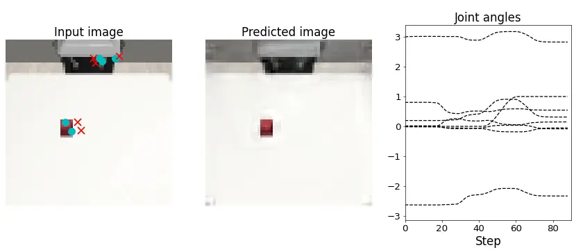
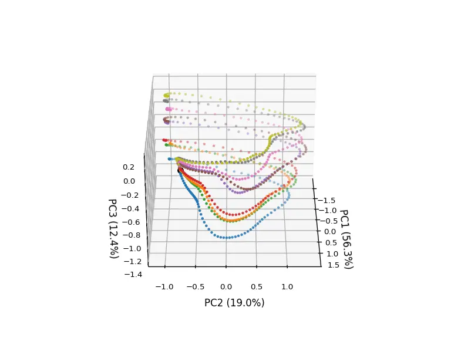

# Model Training

## Train
Move to the `sarnn folder` and start training the model. The trained weights are saved in the log folder. If you want to perform validation without training the model, download the trained weights from [here](https://drive.google.com/file/d/1H4NKKAsNG0gwPemBR1N34s5A94KOH6R1/view?usp=sharing) and save it in the log folder.


```bash linenums="1"
$ cd ../sarnn/
$ python3 ./bin/train.py
[INFO] Set tag = YEAR_DAY_TIME
================================
batch_size : 5
compile : False
device : 0
epoch : 10000
heatmap_size : 0.1
img_loss : 0.1
joint_loss : 1.0
k_dim : 5
log_dir : log/
lr : 0.0001
model : sarnn
n_worker : 8
optimizer : adam
pt_loss : 0.1
rec_dim : 50
stdev : 0.1
tag : YEAR_DAY_TIME
temperature : 0.0001
vmax : 1.0
vmin : 0.0
================================
 96%|███████████████████ | 9551/10000 [1:56:01<05:31,  1.35it/s, train_loss=0.00066, test_loss=0.00111]
```


<!-- ******************************** -->
----
## Test
Specifying a weight file as the argument of `test.py` will save a gif animation of the predicted image, attention points, and predicted joint angles in the output folder.

```bash linenums="1"
$ python3 ./bin/test.py --filename ./log/YEAR_DAY_TIME/SARNN.pth
$ ls ./output/
$ SARNN_YEAR_DAY_TIME_0.gif
```

{: .center}


<!-- ******************************** -->
----
## Visualization of internal representation using PCA
Specifying a weight file as the argument of `test_pca_sarnn.py` will save the internal representation of the RNN as a gif animation.

```bash linenums="1"
$ python3 ./bin/test_pca_sarnn.py ./log/YEAR_DAY_TIME/SARNN.pth
$ ls ./output/
$ PCA_SARNN_YEAR_DAY_TIME.gif
```

{: .center}