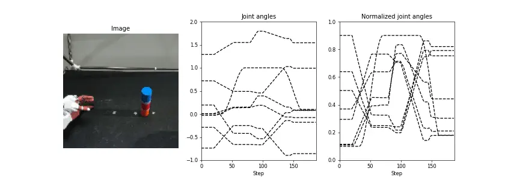

# Generate dataset


<!-- ******************************** -->
## Download
Here, we generate a dataset for deep predictive learning using sensor information from teaching object grasping movements using AIREC.
In this section, we describe how to extract only specific files from multiple rosbag data and save them in npz format using the collected sample data and scripts.
Follow the commands below to download and extract the files.

```bash 
$ mkdir ~/tmp
$ cd tmp
$ wget https://dl.dropboxusercontent.com/s/90wkfttf9w0bz0t/rosbag.tar
$ tar xvf rosbag.tar
$ cd rosbag
$ ls
1_rosbag2npz.py  2_make_dataset.py  3_check_data.py  bag  data  output  utils.py
```


<!-- ******************************** -->
----
## Files
The contents of the download file consist of the following files.
Users can generate training data from rosbag data simply by executing the programs in the order of program number 1.

- **1_rosbag2npy.py**: Extracts only the specified information (topic data) from rosbag data and converts it to npz format.
- **2_make_dataset.py**: This program performs three processes: First, formatting the data length. Even if the `--duration` argument is set at `rosbag record`, the time-series length of the data differs depending on the timing of program execution, so it is necessary to align the time-series length of all the data. The second is to sort and save training and test data based on a specified index. The third is to calculate the normalization parameters (upper and lower limits) for the joint angles. For details of this process, please click [here](../tips/normalization.md).
- **3_check_data.py**: A program to visualize the collected data, this program saves the image and joint angles of the robot as gifs. Before executing the training program, be sure to check the cropping range of the image and the normalized range of the joint angles.
- **utils.py**: Pre-processing programs (e.g., normalization) required for the data set are stored.
- **bag**: The collected `rosbag` data are stored.
- **data**: After running `2_make_dataset.py`, the training and test data and the normalization parameters for the joint angles are saved.
- **output**: The visualization results are saved. The number at the end of the file name indicates the index of the training data.


<!-- ******************************** -->
----
## Data extraction
The following command can extract only the specified information (topic data) from rosbag data.
The details of the arguments are as follows:

- **bag_dir**: Specify the directory where rosbag data are stored.
- **freq**: Since the sampling rate (Hz) varies by sensor, the data is extracted and stored at the specified sampling rate.

```bash
$ python3 1_rosbag2npz.py ./bag/ --freq 10
Failed to load Python extension for LZ4 support. LZ4 compression will not be available.
./bag/rollout_001.bag
1664630681.9616075
1664630682.0616074
1664630682.1616075
1664630682.2616074
```

Since saving all topics in the npz file consumes a huge amount of memory, this script saves the robot sensor information (camera image, joint angle, and gripper state) as an example.
In line 31-35, the names of the topics to be saved are listed, and in lines 50-87, data is extracted from the messages of each topic and saved in a list prepared in advance.
Note that saving the camera image as it is requires a huge amount of space, so it is recommended to resize or crop the image in advance.
Even if sampling is performed at regular intervals, the data length of the topics may differ depending on the start and end timing of the rosbag record, so the time series length is adjusted after line 95.
The program can be applied to the user's own robot by changing the topic name and data extraction method.


```python title="<a href=https://github.com/ogata-lab/eipl/blob/master/eipl/tutorials/ros/1_rosbag2npz.py>[SOURCE] 1_rosbag2npz.py</a>" linenums="1" hl_lines="31-35 50-87 95-102"
import os
import cv2
import glob
import rospy
import rosbag
import argparse
import numpy as np


parser = argparse.ArgumentParser()
parser.add_argument("bag_dir", type=str)
parser.add_argument("--freq", type=float, default=10)
args = parser.parse_args()


files = glob.glob(os.path.join(args.bag_dir, "*.bag"))
files.sort()
for file in files:
    print(file)
    savename = file.split(".bag")[0] + ".npz"

    # Open the rosbag file
    bag = rosbag.Bag(file)

    # Get the start and end times of the rosbag file
    start_time = bag.get_start_time()
    end_time = bag.get_end_time()

    # Get the topics in the rosbag file
    # topics = bag.get_type_and_topic_info()[1].keys()
    topics = [
        "/torobo/joint_states",
        "/torobo/head/see3cam_left/camera/color/image_repub/compressed",
        "/torobo/left_hand_controller/state",
    ]

    # Create a rospy.Time object to represent the current time
    current_time = rospy.Time.from_sec(start_time)

    joint_list = []
    finger_list = []
    image_list = []
    finger_state_list = []

    prev_finger = None
    finger_state = 0

    # Loop through the rosbag file at regular intervals (args.freq)
    freq = 1.0 / float(args.freq)
    while current_time.to_sec() < end_time:
        print(current_time.to_sec())

        # Get the messages for each topic at the current time
        for topic in topics:
            for topic_msg, msg, time in bag.read_messages(topic):
                if time >= current_time:
                    if topic == "/torobo/joint_states":
                        joint_list.append(msg.position[7:14])

                    if topic == "/torobo/head/see3cam_left/camera/color/image_repub/compressed":
                        np_arr = np.frombuffer(msg.data, np.uint8)
                        np_img = cv2.imdecode(np_arr, cv2.IMREAD_COLOR)
                        np_img = np_img[::2, ::2]
                        image_list.append(np_img[150:470, 110:430].astype(np.uint8))

                    if topic == "/torobo/left_hand_controller/state":
                        finger = np.array(msg.desired.positions[3])
                        if prev_finger is None:
                            prev_finger = finger

                        if finger - prev_finger > 0.005 and finger_state == 0:
                            finger_state = 1
                        elif prev_finger - finger > 0.005 and finger_state == 1:
                            finger_state = 0
                        prev_finger = finger

                        finger_list.append(finger)
                        finger_state_list.append(finger_state)

                    break

        # Wait for the next interval
        current_time += rospy.Duration.from_sec(freq)
        rospy.sleep(freq)

    # Close the rosbag file
    bag.close()

    # Convert list to array
    joints = np.array(joint_list, dtype=np.float32)
    finger = np.array(finger_list, dtype=np.float32)
    finger_state = np.array(finger_state_list, dtype=np.float32)
    images = np.array(image_list, dtype=np.uint8)

    # Get shorter lenght
    shorter_length = min(len(joints), len(images), len(finger), len(finger_state))

    # Trim
    joints = joints[:shorter_length]
    finger = finger[:shorter_length]
    images = images[:shorter_length]
    finger_state = finger_state[:shorter_length]

    # Save
    np.savez(savename, joints=joints, finger=finger, finger_state=finger_state, images=images)
```


<!-- ******************************** -->
----
## Generate train/test data
The following command generates training and test data from the npz file converted in the previous section.

```bash 
$ python3 2_make_dataset.py
./bag/rollout_001.npz
./bag/rollout_002.npz
./bag/rollout_003.npz
./bag/rollout_004.npz
./bag/rollout_005.npz
```

This program consists of the following three steps, and each generated data is stored in the `data` folder.
First, all data are loaded using the `load_data` function.
Lines 21, 22, 28, and 29 perform the following operations.

- **resize_img**: Resizes the image to the specified size. Based on the `cv2.resize` function, this function supports time-series images.
- **cos_interpolation**: To facilitate learning and prediction of sharply changing 0/1 binary data, such as robot hand open/close commands, cos interpolation are used to reshape the data into smooth open/close commands. For more information, see [here](../tips/normalization.md#cos-interpolation).
- **list_to_numpy**: Even if you specify a storage time `--duration` for `rosbag record`, the sequence length of all rosbag data is not always the same due to the execution timing of the ROS system. Therefore, the data length is standardized and formatted by performing padding processing according to the longest sequence.

Lines 43-46 then sort the training and test data based on the indexes specified by the user (lines 36 and 37).
The relationship between the teaching position and the index is shown in the table below.
Positions A-E in the table are [object position](./overview.md#task). 4 training data were collected for each teaching position and 1 test data for all positions.
In other words, a total of 15 data were collected.
When the model is evaluated using only the test data collected at the teaching positions, it is difficult to acquire generalization behavior at unlearned positions due to overlearning at the teaching positions.
Therefore, it is important to include even a small amount of untrained positions in the test data in order to acquire generalization performance in a variety of positions.

Finally, in lines 49-50, the upper and lower limits of each joint angle are calculated and stored as normalization parameters for the joint angles.
For more information on why the upper and lower limits of the joint angles are calculated, see [here](../tips/normalization.md#joint_norm).

| Position    | A       | B     | C     | D     | E           |
| :---------- | :-----: |:-----:|:-----:|:-----:| :----------:|
| train       | 0,1,2,3 | None  |5,6,7,8| None  | 10,11,12,13 |
| test        | 4       | 15    |9      | 16    | 14          |


```python title="<a href=https://github.com/ogata-lab/eipl/blob/master/eipl/tutorials/ros/2_make_dataset.py>[SOURCE] 2_make_dataset.py</a>" linenums="1" hl_lines="21-22 28-29 43-46 49-50"
import os
import cv2
import glob
import argparse
import numpy as np
import matplotlib.pylab as plt
from eipl.utils import resize_img, calc_minmax, list_to_numpy, cos_interpolation


def load_data(dir):
    joints = []
    images = []
    seq_length = []

    files = glob.glob(os.path.join(dir, "*.npz"))
    files.sort()
    for filename in files:
        print(filename)
        npz_data = np.load(filename)

        images.append(resize_img(npz_data["images"], (128, 128)))
        finger_state = cos_interpolation(npz_data["finger_state"])
        _joints = np.concatenate((npz_data["joints"], finger_state), axis=-1)
        joints.append(_joints)
        seq_length.append(len(_joints))

    max_seq = max(seq_length)
    images = list_to_numpy(images, max_seq)
    joints = list_to_numpy(joints, max_seq)

    return images, joints


if __name__ == "__main__":
    # dataset index
    train_list = [0, 1, 2, 3, 5, 6, 7, 8, 10, 11, 12, 13]
    test_list = [4, 9, 14, 15, 16]

    # load data
    images, joints = load_data("./bag/")

    # save images and joints
    np.save("./data/train/images.npy", images[train_list].astype(np.uint8))
    np.save("./data/train/joints.npy", joints[train_list].astype(np.float32))
    np.save("./data/test/images.npy", images[test_list].astype(np.uint8))
    np.save("./data/test/joints.npy", joints[test_list].astype(np.float32))

    # save joint bounds
    joint_bounds = calc_minmax(joints)
    np.save("./data/joint_bounds.npy", joint_bounds)
```


<!-- ******************************** -->
----
## Visualization of datasets

The following command will save the robot's image and joint angles as a gif animation.
The argument `idx` is the index of the data to be visualized.
The result shows that the joint angles range from [-0.92, 1.85] to [0.1, 0.9], which is within the normalized range specified by the user.
The following figure shows the actually generated GIF animation, from left to right: camera image, robot joint angles, and robot joint angles after normalization.
If the cropping of the image or the normalization range of the joint angle is different from the expected range, it is highly likely that errors occurred in the `resize_img` and `calc_minmax` processes in the previous section.


```bash
$ python3 3_check_data.py --idx 4
load test data, index number is 4
Joint: shape=(5, 187, 8), min=-0.92, max=1.85
Norm joint: shape=(5, 187, 8), min=0.1, max=0.9
```

{: .center}


```python title="<a href=https://github.com/ogata-lab/eipl/blob/master/eipl/tutorials/ros/3_check_data.py>[SOURCE] 3_check_data.py</a>" linenums="1"
import argparse
import numpy as np
import matplotlib.pylab as plt
import matplotlib.animation as anim
from eipl.utils import normalization


parser = argparse.ArgumentParser()
parser.add_argument("--idx", type=int, default=0)
args = parser.parse_args()

idx = int(args.idx)
joints = np.load("./data/test/joints.npy")
joint_bounds = np.load("./data/joint_bounds.npy")
images = np.load("./data/test/images.npy")
N = images.shape[1]


# normalized joints
minmax = [0.1, 0.9]
norm_joints = normalization(joints, joint_bounds, minmax)

# print data information
print("load test data, index number is {}".format(idx))
print("Joint: shape={}, min={:.3g}, max={:.3g}".format(joints.shape, joints.min(), joints.max()))
print(
    "Norm joint: shape={}, min={:.3g}, max={:.3g}".format(
        norm_joints.shape, norm_joints.min(), norm_joints.max()
    )
)

# plot images and normalized joints
fig, ax = plt.subplots(1, 3, figsize=(14, 5), dpi=60)


def anim_update(i):
    for j in range(3):
        ax[j].cla()

    # plot image
    ax[0].imshow(images[idx, i, :, :, ::-1])
    ax[0].axis("off")
    ax[0].set_title("Image")

    # plot joint angle
    ax[1].set_ylim(-1.0, 2.0)
    ax[1].set_xlim(0, N)
    ax[1].plot(joints[idx], linestyle="dashed", c="k")

    for joint_idx in range(8):
        ax[1].plot(np.arange(i + 1), joints[idx, : i + 1, joint_idx])
    ax[1].set_xlabel("Step")
    ax[1].set_title("Joint angles")

    # plot normalized joint angle
    ax[2].set_ylim(0.0, 1.0)
    ax[2].set_xlim(0, N)
    ax[2].plot(norm_joints[idx], linestyle="dashed", c="k")

    for joint_idx in range(8):
        ax[2].plot(np.arange(i + 1), norm_joints[idx, : i + 1, joint_idx])
    ax[2].set_xlabel("Step")
    ax[2].set_title("Normalized joint angles")


ani = anim.FuncAnimation(fig, anim_update, interval=int(N / 10), frames=N)
ani.save("./output/check_data_{}.gif".format(idx))
```
