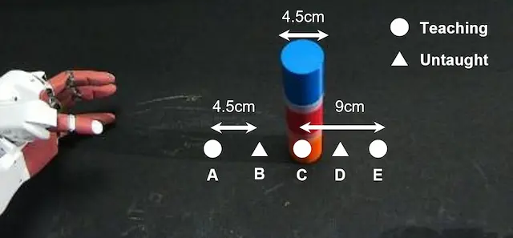

# Overview

This section describes how to create a dataset for deep predictive learning from robot sensor data `rosbag` obtained from motion instruction using ROS.
For better understanding, it is recommended to [download (1.3GB)](https://dl.dropboxusercontent.com/s/90wkfttf9w0bz0t/rosbag.tar) the collected data and scripts and run them according to the manual.

<!-- ******************************** -->
----
## Experimental Task {#task}

The AIREC(AI-driven Robot for Embrace and Care), a smart robot manufactured by [Tokyo Robotics](https://robotics.tokyo/), is used to teach object grasping.
The following figure shows an overview of the task. Based on the object grasping experience at the teaching positions shown in the figure (three circled points), the generalization performance at the unlearned positions (two points) is evaluated.
The training data was collected 4 times for each teaching position for a total of 12 data, and the test data was collected once for each of the 5 locations, including the unlearned positions, for a total of 5 data.

{: .center}

<!-- ******************************** -->
----
## Motion Teaching {#teaching}
AIREC is a robot system that enables bilateral teleoperation as shown below. The operator can teach a multi-degree-of-freedom robot more intuitively by teaching its motion based on the robot visual image displayed on the monitor and force feedback from the robot. Here, the sensor information (joint angle, camera image, torque information, etc.) of the robot when teaching a task using the teleoperation device is saved in 'rosbag' format, and a dataset is created for the machine learning model in the following sections.

Note that it is possible to teach motion to a robot without such a specialized device.
In the [Real Robot Application section](./robot/overview), two types of motion teaching methods using OpenManipulator are described: leader-follower system and joystick.

<html lang="ja">
<head>
  <link rel="stylesheet" href="index.css">
</head>
<body>
  

    <iframe class="youtube" width="640" height="360" src="https://www.youtube.com/embed/ivksUcWIK4g" title="Bilateral teleoperation of a humanoid robot Dry-AIREC" frameborder="0" allow="accelerometer; autoplay; clipboard-write; encrypted-media; gyroscope; picture-in-picture" allowfullscreen></iframe>
  

</body>
</html>

