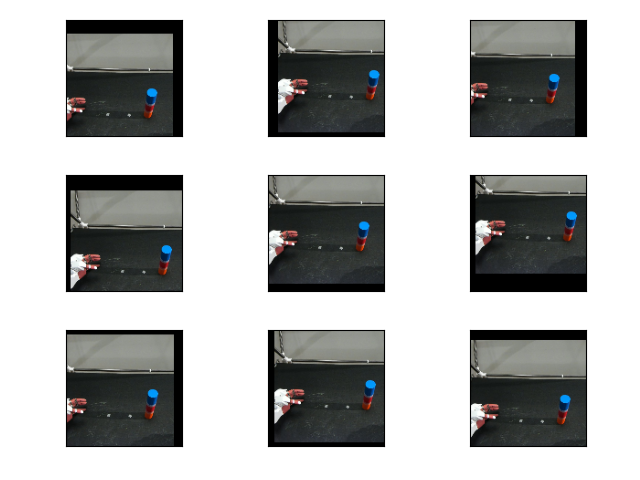
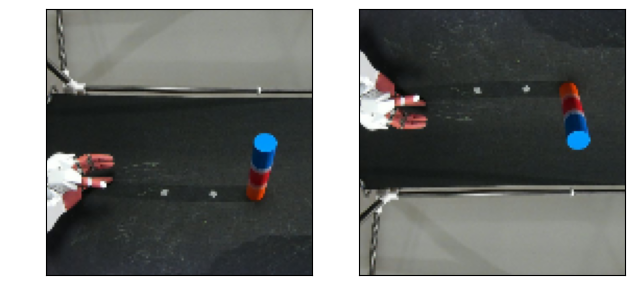
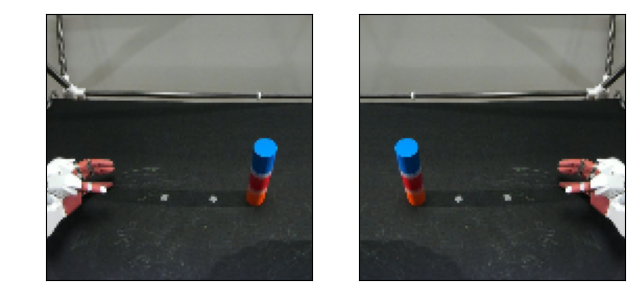
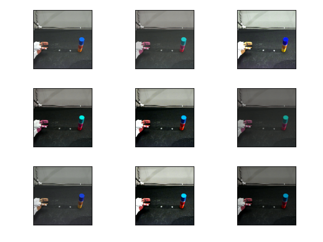
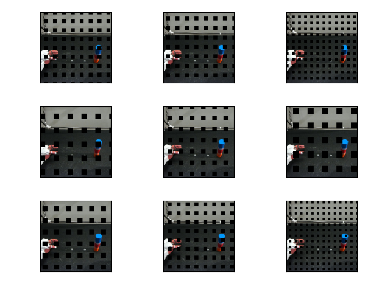

## transforms.RandomAffine
[transforms.RandomAffine](https://pytorch.org/vision/main/generated/torchvision.transforms.RandomAffine.html) is a function that applies a random affine transformation to an image. Affine transformations can translate, rotate, scale, or distort an image. The figure below shows the result of translating an image vertically and horizontally. When affine transforms are used during AutoEncoder training, they allow for the expression (extraction) of object position information as image features, allowing for appropriate reconstruction even for unlearned positions.

----
## transforms.RandomVerticalFlip
[transforms.RandomVerticalFlip](https://pytorch.org/vision/main/generated/torchvision.transforms.RandomVerticalFlip.html) is a function that randomly flips the input image vertically to increase data diversity.

----
## transforms.RandomHorizontalFlip
[transforms.RandomHorizontalFlip](https://pytorch.org/vision/main/generated/torchvision.transforms.RandomHorizontalFlip.html) is a function that randomly flips the input image horizontally and can be combined with `RandomVerticalFlip` to improve the generalization performance of the model.

----
## transforms.ColorJitter
[transforms.ColorJitter](https://pytorch.org/vision/main/generated/torchvision.transforms.ColorJitter.html) is a function that applies random color transformations to an input image, allowing adjustments to its brightness, contrast, saturation, and hue. The figure below illustrates the effects of such transformations.

----
## GridMask
GridMask is a method used to increase the diversity of the training data by masking parts of the image with a grid-like pattern[@chen2020gridmask]. As shown in the figure below, this technique aims to improve the generalization performance of the model by training it on image data where certain parts are missing. When applied to a [SARNN model](../model/SARNN.md), the missing parts of the image do not attract attention, allowing the model to learn spatial attention, which is crucial for motion prediction. The source code for GridMask is available [here](https://github.com/ogata-lab/eipl/blob/master/eipl/layer/GridMask.py).

