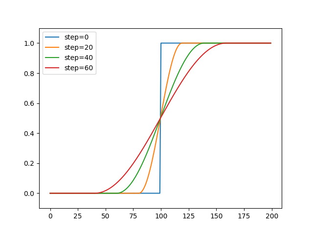

## Joint Angle Normalization {#joint_norm}

Since the robot camera image is represented by an integer value of 256 shades (0-255 = 8 bits), normalization should be performed to fit within an arbitrary range (e.g., [0.0, 1.0]) from [0, 255].
On the other hand, the possible range of robot joint angles varies depending on the joint structure, range of movement, and teaching task.
The simplest normalization method is to normalize based on the maximum and minimum values of the training data, but the normalization range is pulled down by the joints with large movements, and it is difficult to learn fine movements.
Therefore, by normalizing based on the maximum and minimum values of each joint, it is possible to emphasize and learn fine movements.

The following figure shows the results of normalization of joint angles during object grasping operation.
From the left are the results of normalization based on the maximum and minimum values of the collected raw data and training data (overall normalization) and normalization based on the maximum and minimum values of each joint angle (joint normalization).
In the case of overall normalization, there is no significant change in the waveform after normalization compared to the raw data, and the range of joint angles is simply converted from 0.0 to 1.0.
On the other hand, when joint normalization is performed, both rough motion (e.g., gray waveform) and fine motion (blue waveform) are more pronounced because normalization is performed for each joint.
This makes it possible to learn robot motions with higher accuracy than with global normalization.

!!! note
    Depending on the task, some joints may not move at all or change only slightly. If joint normalization is applied to such joints, the waveforms after normalization will be greatly distorted, which may adversely affect learning. It is recommended to check the waveforms after normalization and manually adjust the normalization range if such joint waveforms exist. Note that joint normalization is not suitable for originally noisy data such as torque and current values.

----
## Cosine Interpolation {#cos-interpolation}
When a model learns data expressed as ON/OFF, such as opening/closing commands of a robot hand or a PSD (Position Sensitive Detector) sensor, it is possible to facilitate learning by performing smoothing in advance.
The following is the result of applying smoothing to the original data (blue square wave) using cosin interpolation,
and the smoothness can be adjusted according to the argument (`step` size).

