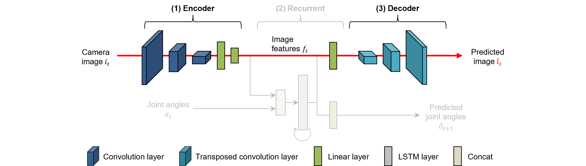
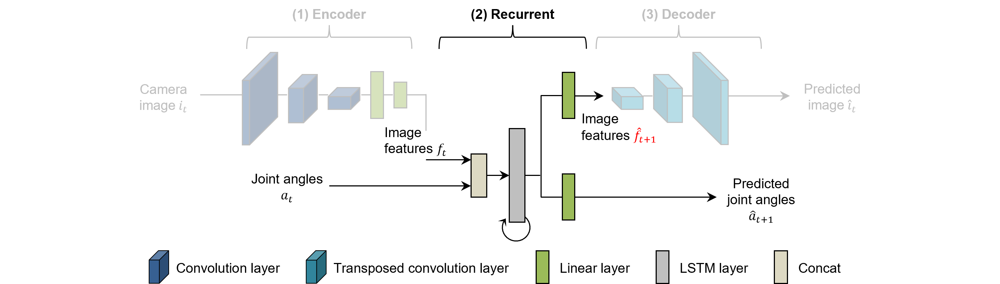
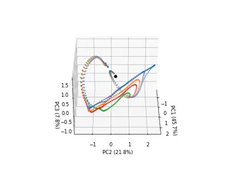

# CAE-RNN {#cae-rnn}

CAE-RNN is a motion generation model that consists of an image feature extraction part and a time series learning part, which aims to learn the robot's sensorimotor information[@ito2022efficient] [@yang2016repeatable]. The network structure of the CAE-RNN model is shown in the figure below. It consists of a Convolutional Auto-Encoder (CAE), which is responsible for extracting image features from the robot's visual information, and a Recurrent Neural Network (RNN), which learns the time-series information of the robot's joint angles and image features. CAE-RNN enables independent training of the image feature extraction part and the time series learning part, which are sequentially trained first with CAE and then with RNN. By learning a variety of sensorimotor information, CAE-RNN can extract image features such as the position and shape of flexible objects, which are traditionally difficult to recognize, and generate corresponding motions. This section provides a step-by-step explanation of the implementation, training, inference, and analysis of [internal representation analysis](#rnn_pca).


{: .center}


<!-- #################################################################################################### -->
----
## CAE {#cae}
### Overview {#cae_overview}
Since visual images are high-dimensional compared to the robot's motion information, it is essential to align the dimensions of each modality to properly learn sensorimotor information. In addition, to capture the relationship between object position and motion, it is necessary to extract low-dimensional image features (such as position, color, shape, etc.) from the high-dimensional visual images. To achieve this, a Convolutional Auto-Encoder (CAE) is used to extract image features. The figure below focuses specifically on the CAE network structure within CAE-RNN, which consists of an encoder responsible for extracting image features from the robot's visual information ($i_t$) and a decoder that reconstructs the image ($\hat i_t$) from the extracted features. By updating the weights of each layer to minimize the error between input and output values, the layer with the fewest number of neurons (known as the bottleneck layer) in the middle layer can abstractly represent the input information.

{: .center}

<!-- #################################################################################################### -->
----      
### Files {#cae_files}
The programs and folders used in CAE are as follows:

- **bin/train.py**: This program is used to load data, train models, and save the trained models.
- **bin/test.py**: This program performs off-line inference of models using test data (images and joint angles) and visualizes the inference results.
- **bin/extract.py**：This program calculates and stores the image features extracted by the CAE, as well as the upper and lower bounds for normalization.
- **libs/trainer.py**：This is the backpropagation class for the CAE, responsible for training the model.
- **log**: This folder is used to store the weights, learning curves, and parameter information.
- **output**: This folder stores the inference results.
- **data**：This folder stores the RNN training data, including joint angles, image features, and normalization information.


<!-- #################################################################################################### -->
----
### CAE Model  {#cae_model}
CAE consists of a convolution layer, a transposed convolution layer, and a linear layer. By using the convolutional layer (CNN) to extract image features, CAE can handle high-dimensional information with fewer parameters compared to AutoEncoder[@hinton2006reducing], which only consists of a linear layer. In addition, CNN can extract different image features by convolving with shifting filters. The pooling layer, usually applied after CNN, is often used in image recognition and other fields to reduce the dimensionality of the input data. However, while it simultaneously achieves position invariance and information compression, there is a problem of losing spatial structure information in the image[@sabour2017dynamic]. Since spatial position information of manipulated objects and robot hands is crucial for robot motion generation, dimensional compression is performed using the convolution stride (the interval at which the CNN filter is applied) instead of the pooling layer.

The following program shows the CAE model capable of extracting image features with the specified dimension `feat_dim` from a 128x128 pixel color image. This model uses a simple network structure to help understand the overall architecture and implementation of CAE.


```python title="<a href=https://github.com/ogata-lab/eipl/blob/master/eipl/model/CAE.py>[SOURCE] BasicCAE.py</a>" linenums="1"
class BasicCAE(nn.Module):
    def __init__(self, feat_dim=10):
        super(BasicCAE, self).__init__()

        # encoder
        self.encoder = nn.Sequential(
            nn.Conv2d(3, 64, 3, 2, 1),
            nn.Tanh(),
            nn.Conv2d(64, 32, 3, 2, 1),
            nn.Tanh(),
            nn.Conv2d(32, 16, 3, 2, 1),
            nn.Tanh(),
            nn.Conv2d(16, 12, 3, 2, 1),
            nn.Tanh(),
            nn.Conv2d(12, 8, 3, 2, 1),
            nn.Tanh(),
            nn.Flatten(),
            nn.Linear(8 * 4 * 4, 50),
            nn.Tanh(),
            nn.Linear(50, feat_dim),
            nn.Tanh(),
        )

        # decoder
        self.decoder = nn.Sequential(
            nn.Linear(feat_dim, 50),
            nn.Tanh(),
            nn.Linear(50, 8 * 4 * 4),
            nn.Tanh(),
            nn.Unflatten(1, (8, 4, 4)),
            nn.ConvTranspose2d(8, 12, 3, 2, padding=1, output_padding=1),
            nn.Tanh(),
            nn.ConvTranspose2d(12, 16, 3, 2, padding=1, output_padding=1),
            nn.Tanh(),
            nn.ConvTranspose2d(16, 32, 3, 2, padding=1, output_padding=1),
            nn.Tanh(),
            nn.ConvTranspose2d(32, 64, 3, 2, padding=1, output_padding=1),
            nn.Tanh(),
            nn.ConvTranspose2d(64, 3, 3, 2, padding=1, output_padding=1),
            nn.Tanh(),
        )

    def forward(self, x):
        return self.decoder(self.encoder(x))
```

By incorporating the `ReLU` function and `Batch Normalization`[@ioffe2015batch], it is possible to increase the expressiveness of each layer, mitigate gradient loss, and improve the efficiency and stability of the learning process. This software library already contains CAE models that use `Batch Normalization`, which can be loaded as shown below. The difference between BasicCAENE and CAEBN lies in the structure of the model (parameter size), more details can be found in the [source code](https://github.com/ogata-lab/eipl/blob/master/eipl/model/CAEBN.py). Please note that the implemented model expects input in the format of a 128x128 pixel color image. If you want to input images of different sizes, you will need to adjust the parameters accordingly.


```python
from eipl.model import BasicCAENE, CAEBN
```


<!-- #################################################################################################### -->
----
### Back Propagation {#cae_bp}
During the CAE learning process, the robot's camera images ($i_t$) are used as input to generate reconstructed images ($\hat i_t$). In this process, the model parameters are updated using the backpropagation method [@rumelhart1986learning] to minimize the error between the input and reconstructed images. In lines 27-33 of the code, the batch of input images `xi` is passed through the model to obtain the reconstructed images `yi_hat`. The mean square error (nn.MSELoss) between the reconstructed images and the corresponding true images `yi` is then computed, and the error value `loss` is used to propagate the gradients through the model for parameter updates. This autoregressive learning approach eliminates the need for the complex manual design of image features typically required in conventional robotics. It is worth noting that [data augmentation techniques](../tips/augmentation.md), such as randomly adjusting brightness, contrast, and position, are used during training to extract image features that are robust to various real-world noise sources.


```python title="<a href=https://github.com/ogata-lab/eipl/blob/master/eipl/zoo/cae/libs/trainer.py>[SOURCE] trainer.py</a>" linenums="1" hl_lines="27-33"
class Trainer:
    def __init__(self, model, optimizer, device="cpu"):
        self.device = device
        self.optimizer = optimizer
        self.model = model.to(self.device)

    def save(self, epoch, loss, savename):
        torch.save(
            {
                "epoch": epoch,
                "model_state_dict": self.model.state_dict(),
                "train_loss": loss[0],
                "test_loss": loss[1],
            },
            savename,
        )

    def process_epoch(self, data, training=True):
        if not training:
            self.model.eval()

        total_loss = 0.0
        for n_batch, (xi, yi) in enumerate(data):
            xi = xi.to(self.device)
            yi = yi.to(self.device)

            yi_hat = self.model(xi)
            loss = nn.MSELoss()(yi_hat, yi)
            total_loss += loss.item()

            if training:
                self.optimizer.zero_grad(set_to_none=True)
                loss.backward()
                self.optimizer.step()

        return total_loss / n_batch
```


<!-- #################################################################################################### -->
----
### Training {cae_train}
We use the `Model`, the `Trainer Class`, and the pre-implemented main program `train.py` to train the CAE model. When the program is run, a folder with a name indicating the execution date and time of execution (e.g., 20230427_1316_29) is created in the `log` folder. This folder will contain the trained weights (pth) and the TensorBoard log file. The program allows command line arguments to specify essential training parameters, such as the model type, number of epochs, batch size, learning rate, and optimization method. The EarlyStopping library is also used to determine when to stop training early and to save the weights when the test error is minimized (`save_ckpt=True`). For a detailed explanation of how the program works, please refer to the comments inside the [code](https://github.com/ogata-lab/eipl/blob/master/eipl/zoo/cae/bin/train.py).

```bash
$ cd eipl/zoo/cae/
$ python3 ./bin/train.py
[INFO] Set tag = 20230427_1316_29
================================
batch_size : 128
device : 0
epoch : 100000
feat_dim : 10
log_dir : log/
lr : 0.001
model : CAE
optimizer : adam
stdev : 0.02
tag : 20230427_1316_29
vmax : 1.0
vmin : 0.0
================================
0%|               | 11/100000 [00:40<101:55:18,  3.67s/it, train_loss=0.0491, test_loss=0.0454]
```


<!-- #################################################################################################### -->
----
### Inference {cae_inference}
Use the `test.py` program to verify that the CAE has been trained correctly. The argument `filename` is the path to the file containing the trained weights, and `idx` is the index of the data to be visualized. The lower (top) figure shows the inference results of the CAEBN model using this program, with the input image on the left and the reconstructed image on the right. Since the robot hand and the grasping object are reconstructed in the "untaught position", which is important for the generation of the robot motion, it can be assumed that the image features represent information such as the object's position and shape. The lower figure (bottom) is also an example of failure, showing that the object is not adequately predicted by the basic CAE model with a simple network structure. In this case, it is necessary to adjust the method of the optimization algorithm, the learning rate, the loss function, and the structure of the model.


```bash
$ cd eipl/zoo/cae/
$ python3 ./bin/test.py --filename ./log/20230424_1107_01/CAEBN.pth --idx 4
$ ls output/
CAEBN_20230424_1107_01_4.gif
```

{: .center}

{: .center}


<!-- #################################################################################################### -->
---
### Extract Image Features {cae_extract_feat}
To prepare for time series learning of image features and robot joint angles with RNN, you need to extract the image features from CAE. Running the following program will save the image features and joint angles of the training and test data in the `data` folder in npy format. Make sure that the number of data and the length of the time series for the extracted image features and joint angles are the same. The joint angles are saved again to make it easier to load the dataset during RNN training.


```bash
$ cd eipl/zoo/cae/
$ python3 ./bin/extract.py --filename ./log/20230424_1107_01/CAEBN.pth
[INFO] train data
==================================================
Shape of joints angle: torch.Size([12, 187, 8])
Shape of image feature: (12, 187, 10)
==================================================

[INFO] test data
==================================================
Shape of joints angle: torch.Size([5, 187, 8])
Shape of image feature: (5, 187, 10)
==================================================

$ ls ./data/*
data/test:
features.npy  joints.npy

data/train:
features.npy  joints.npy
```

The following code snippet is part of the source code of `extract.py`, which performs the extraction and saving of the image features. In the fourth line, the encoder process of CAE is executed and the resulting low-dimensional image features are returned. The extracted image features from CAE are then normalized to fit within the range specified by the user and used for RNN training. When `tanh` is used as the activation function for the model, the upper and lower bounds of the image features (`feat_bounds`) remain constant (-1.0 to 1.0). However, for CAEBN, which uses `ReLU` as the activation function, the upper and lower bounds of the image features are indeterminate. Therefore, in line 25, the upper and lower bounds of the image features are determined by calculating the maximum and minimum values from the extracted image features of both the training and test data.


```python title="<a href=https://github.com/ogata-lab/eipl/blob/master/eipl/zoo/cae/bin/extract.py>[SOURCE] extract.py</a>" linenums="1" hl_lines="4 25"
    # extract image feature
    feature_list = []
    for i in range(N):
        _features = model.encoder(images[i])
        feature_list.append( tensor2numpy(_features) )

    features = np.array(feature_list)
    np.save('./data/joint_bounds.npy', joint_bounds )
    np.save('./data/{}/features.npy'.format(data_type), features )
    np.save('./data/{}/joints.npy'.format(data_type), joints )
    
    print_info('{} data'.format(data_type))
    print("==================================================")
    print('Shape of joints angle:',  joints.shape)
    print('Shape of image feature:', features.shape)
    print("==================================================")
    print()

# save features minmax bounds
feat_list = []
for data_type in ['train', 'test']:
    feat_list.append( np.load('./data/{}/features.npy'.format(data_type) ) )

feat = np.vstack(feat_list)
feat_minmax = np.array( [feat.min(), feat.max()] )
np.save('./data/feat_bounds.npy', feat_minmax )
```


<!-- #################################################################################################### -->
----
## RNN {#rnn}

### Overview {#rnn_overview}
A Recurrent Neural Network (RNN) is used to integrate and learn the robot's sensorimotor information of the robot. The figure below shows the network structure of the RNN within CAE-RNN, which takes image features ($f_t$) and joint angles ($a_t$) at time $t$ and predicts them at the next time step $t+1$.

{: .center}


<!-- #################################################################################################### -->
----
### Files {#rnn_files}
The programs and folders used in RNN are as follows:

- **bin/train.py**: Program to load data, train and save models.
- **bin/test.py**: Program for offline inference of models using test data (images and joint angles) and visualization of inference results.
- **bin/test_pca_cnnrnn.py**: Program to visualize the internal state of an RNN using principal component analysis.
- **libs/fullBPTT.py**: Backpropagation class for time series learning.
- **bin/rt_predict.py**: Program that integrates the trained CAE and RNN models to predict motor commands based on images and joint angles.
- **libs/dataloader.py**: DataLoader for RNN providing image features and joint angles.
- **log**: Folder for storing weights, learning curves, and parameter information.
- **output**: Folder for storing inference results.


<!-- #################################################################################################### -->
----
### RNN Model  {#rnn_model}
RNN is a type of neural network that can learn and infer time series data, allowing sequential state changes based on input values for time series prediction. However, vanilla RNN is susceptible to gradient loss during backpropagation. To address this problem, Long Short-Term Memory (LSTM) and [Multiple Timescales RNN (MTRNN)](../zoo/MTRNN.md) have been proposed.

In this context, we describe a method for learning the integrated sensorimotor information of a robot using LSTM. LSTM includes three gates (input gate, forget gate, and output gate), each with its own weights and biases. The $h_{t-1}$ gate learns detailed changes in the time series as short-term memory, and the $c_{t-1}$ gate learns features of the entire time series as long-term memory. These gates allow the LSTM to remember and forget past information. The following example shows the implementation. The input value `x`, which is a combination of low-dimensional image features and robot joint angles previously extracted by CAE, is fed into the LSTM. LSTM then outputs the predicted value `y_hat` for the image features and robot joint angles at the next time step based on its internal state.


```python title="<a href=https://github.com/ogata-lab/eipl/blob/master/eipl/model/BasicRNN.py>[SOURCE] BasicRNN.py</a>" title="BasicRNN.py" linenums="1"
class BasicLSTM(nn.Module):
    def __init__(self, in_dim, rec_dim, out_dim, activation="tanh"):
        super(BasicLSTM, self).__init__()

        if isinstance(activation, str):
            activation = get_activation_fn(activation)

        self.rnn = nn.LSTMCell(in_dim, rec_dim)
        self.rnn_out = nn.Sequential(nn.Linear(rec_dim, out_dim), activation)

    def forward(self, x, state=None):
        rnn_hid = self.rnn(x, state)
        y_hat = self.rnn_out(rnn_hid[0])

        return y_hat, rnn_hid
```


<!-- #################################################################################################### -->
----
### Backpropagation Through Time {#rnn_bptt}
Backpropagation Through Time (BPTT) is used as the error backpropagation algorithm for time series learning.
The details of BPTT have already been described in SARNN, please see [here](../../model/SARNN#bptt).


```python title="<a href=https://github.com/ogata-lab/eipl/blob/master/eipl/zoo/rnn/libs/fullBPTT.py>[SOURCE] fullBPTT.py</a>" linenums="1"
class fullBPTTtrainer:
    def __init__(self, model, optimizer, device="cpu"):
        self.device = device
        self.optimizer = optimizer
        self.model = model.to(self.device)

    def save(self, epoch, loss, savename):
        torch.save(
            {
                "epoch": epoch,
                "model_state_dict": self.model.state_dict(),
                "train_loss": loss[0],
                "test_loss": loss[1],
            },
            savename,
        )

    def process_epoch(self, data, training=True):
        if not training:
            self.model.eval()

        total_loss = 0.0
        for n_batch, (x, y) in enumerate(data):
            x = x.to(self.device)
            y = y.to(self.device)

            state = None
            y_list = []
            T = x.shape[1]
            for t in range(T - 1):
                y_hat, state = self.model(x[:, t], state)
                y_list.append(y_hat)

            y_hat = torch.permute(torch.stack(y_list), (1, 0, 2))
            loss = nn.MSELoss()(y_hat, y[:, 1:])
            total_loss += loss.item()

            if training:
                self.optimizer.zero_grad(set_to_none=True)
                loss.backward()
                self.optimizer.step()

        return total_loss / (n_batch + 1)
```


<!-- #################################################################################################### -->
----
### Dataloader {#rnn_dataloader}
We describe the `DataLoader` for integrating the image features and robot joint angles extracted by CAE with RNN. As shown in lines 15 and 16, Gaussian noise is added to the input data. By training the model to minimize the error between the predicted values and the original data, the robot can generate appropriate motion commands even in the presence of real-world noise.


```python title="<a href=https://github.com/ogata-lab/eipl/blob/master/eipl/zoo/rnn/libs/dataloader.py>[SOURCE] dataloader.py</a>" linenums="1" hl_lines="15-16"
class TimeSeriesDataSet(Dataset):
    def __init__(self, feats, joints, minmax=[0.1, 0.9], stdev=0.02):
        self.stdev = stdev
        self.feats = torch.from_numpy(feats).float()
        self.joints = torch.from_numpy(joints).float()

    def __len__(self):
        return len(self.feats)

    def __getitem__(self, idx):
        y_feat = self.feats[idx]
        y_joint = self.joints[idx]
        y_data = torch.concat((y_feat, y_joint), axis=-1)

        x_feat = self.feats[idx] + torch.normal(mean=0, std=self.stdev, size=y_feat.shape)
        x_joint = self.joints[idx] + torch.normal(mean=0, std=self.stdev, size=y_joint.shape)

        x_data = torch.concat((x_feat, x_joint), axis=-1)

        return [x_data, y_data]
```


<!-- #################################################################################################### -->
----
### Training {#rnn_train}
The main program, `train.py`, is used to train the RNN. When executing the program, the trained weights (pth) and Tensorboard log files are saved in the `log` folder. For a detailed description of how the program works, please refer to the comments within the [code](https://github.com/ogata-lab/eipl/blob/master/eipl/zoo/rnn/bin/train.py).


```bash 
$ cd eipl/zoo/rnn/
$ python3 ./bin/train.py --device -1
[INFO] Set tag = 20230510_0134_03
================================
batch_size : 5
device : -1
epoch : 100000
log_dir : log/
lr : 0.001
model : LSTM
optimizer : adam
rec_dim : 50
stdev : 0.02
tag : 20230510_0134_03
vmax : 1.0
vmin : 0.0
================================
0%|               | 99/100000 [00:25<7:05:03,  3.92it/s, train_loss=0.00379, test_loss=0.00244
```


<!-- #################################################################################################### -->
----
### Inference {#rnn_inference}
To verify that the RNN is sufficiently trained, the test program `test.py` is used. The argument `filename` represents the path to the trained weights file, while `idx` corresponds to the index of the data to be visualized. To evaluate the generalization performance of the model, [untrained position](../../teach/overview#task) test data is provided and the predicted values are compared with the ground truth. The figure below illustrates the RNN prediction results, with the robot joint angles on the left and the image features on the right. The black dotted line represents the ground truth, while the colored line represents the predicted values. The close resemblance between them indicates that the motion learning process was performed effectively.


```bash 
$ cd eipl/zoo/rnn/
$ python3 ./bin/test.py --filename ./log/20230510_0134_03/LSTM.pth --idx 4
$ ls output/
LSTM_20230510_0134_03_4.gif
```

{: .center}


<!-- #################################################################################################### -->
----
### Principal Component Analysis {#rnn_pca}
For an overview and concrete implementation of Principal Component Analysis (PCA), please refer to the [link provided](../model/test.md#pca)..

```bash
$ cd eipl/zoo/rnn/
$ python3 ./bin/test_pca_rnn.py --filename log/20230510_0134_03/LSTM.pth
$ ls output/
PCA_LSTM_20230510_0134_03.gif
```

The following figure shows the visualization of the internal state of the RNN using PCA. Each dotted line represents the time evolution of the internal state of the RNN, with transitions starting from the black circle. These transition trajectories of the internal state are called attractors. The color assigned to each attractor indicates the [object position](../teach/overview.md#task), where blue, orange, and green correspond to the teaching positions A, C, and E, while red and purple correspond to the untaught positions B and D. The self-organization (alignment) of the attractors based on the object position suggests that behavior is learned and stored accordingly. In particular, the attractors at the untaught positions are generated between the teaching positions, allowing the generation of interpolated movements by repeatedly teaching and learning reaching movements with varying object positions.


{: .center}
