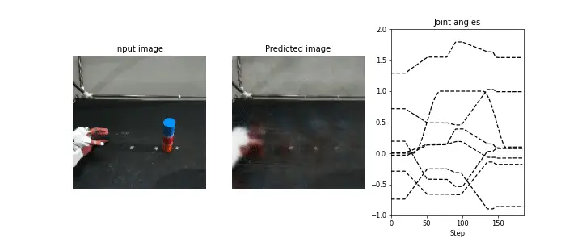

# CNNRNN {#overview}

Due to the independent training of the image feature extraction part (CAE) and the time series learning part (RNN), CAE-RNN has faced challenges in parameter adjustment and model training time. In addition, CAE extracts image features specifically designed for dimensional compression of image information, rather than features suitable for robot motion generation. To address these issues, CNN-RNN is introduced as a motion generation model that can automatically extract image features essential for motion generation by simultaneously learning (end-to-end learning) the image feature extraction part (CAE) and the time series learning part (RNN). This approach enables the robot to prioritize objects critical to the task and generate motions that are more robust to background changes compared to CAE-RNN[@ito2020visualization].

{: .center}


<!-- #################################################################################################### -->
----
## Files {#files}
The following programs and folders are used in CNNRNN:

- **bin/train.py**: This program is used to load data, train models, and save the trained models.
- **bin/test.py**: This program performs offline inference using test data (images and joint angles) and visualizes the results of the inference.
- **bin/test_pca_cnnrnn.py**: This program visualizes the internal state of the RNN using Principal Component Analysis.
- **libs/fullBPTT.py**: This is a `backpropagation` class used for time series learning.
- **log**: This folder is used to store the weights, learning curves, and parameter information.
- **output**: This folder is used to store the results of the inference.


<!-- #################################################################################################### -->
----
## Model {#model}
CNNRNN is a motion generation model that can learn and perform inference on multimodal time series data. It predicts the image `y_image` and joint angle `y_joint` at the next time step $t+1$ based on the image `xi`, joint angle `xv`, and the state `state` at the time step $t$.

```python title="<a href=https://github.com/ogata-lab/eipl/blob/master/eipl/model/CNNRNN.py>[SOURCE] CNNRNN.py</a>" linenums="1"
class CNNRNN(nn.Module):
    def __init__(self, rec_dim=50, joint_dim=8, feat_dim=10):
        super(CNNRNN, self).__init__()

        # Encoder
        self.encoder_image = nn.Sequential(
            nn.Conv2d(3, 64, 3, 2, 1),
            nn.Tanh(),
            nn.Conv2d(64, 32, 3, 2, 1),
            nn.Tanh(),
            nn.Conv2d(32, 16, 3, 2, 1),
            nn.Tanh(),
            nn.Conv2d(16, 12, 3, 2, 1),
            nn.Tanh(),
            nn.Conv2d(12, 8, 3, 2, 1),
            nn.Tanh(),
            nn.Flatten(),
            nn.Linear(8 * 4 * 4, 50),
            nn.Tanh(),
            nn.Linear(50, feat_dim),
            nn.Tanh(),
        )

        # Recurrent
        rec_in = feat_dim + joint_dim
        self.rec = nn.LSTMCell(rec_in, rec_dim)

        # Decoder for joint angle
        self.decoder_joint = nn.Sequential(nn.Linear(rec_dim, joint_dim), nn.Tanh())

        # Decoder for image
        self.decoder_image = nn.Sequential(
            nn.Linear(rec_dim, 8 * 4 * 4),
            nn.Tanh(),
            nn.Unflatten(1, (8, 4, 4)),
            nn.ConvTranspose2d(8, 12, 3, 2, padding=1, output_padding=1),
            nn.Tanh(),
            nn.ConvTranspose2d(12, 16, 3, 2, padding=1, output_padding=1),
            nn.Tanh(),
            nn.ConvTranspose2d(16, 32, 3, 2, padding=1, output_padding=1),
            nn.Tanh(),
            nn.ConvTranspose2d(32, 64, 3, 2, padding=1, output_padding=1),
            nn.Tanh(),
            nn.ConvTranspose2d(64, 3, 3, 2, padding=1, output_padding=1),
            nn.Tanh(),
        )

    def forward(self, xi, xv, state=None):
        # Encoder
        im_feat = self.encoder_image(xi)
        hid = torch.concat([im_feat, xv], -1)

        # Recurrent
        rnn_hid = self.rec(hid, state)

        # Decoder
        y_joint = self.decoder_joint(rnn_hid[0])
        y_image = self.decoder_image(rnn_hid[0])

        return y_image, y_joint, rnn_hid
```


<!-- #################################################################################################### -->
----
## Backpropagation Through Time {#bptt}
Backpropagation Through Time (BPTT) is used as the error backpropagation algorithm for time series learning in CNNRNN. The detailed explanation of BPTT has already been provided in SARNN, please refer to that [section](../../model/SARNN#bptt) for more information.

```python title="<a href=https://github.com/ogata-lab/eipl/blob/master/eipl/zoo/cnnrnn/libs/fullBPTT.py>[SOURCE] fullBPTT.py</a>" linenums="1"
class fullBPTTtrainer:
    def __init__(self, model, optimizer, loss_weights=[1.0, 1.0], device="cpu"):
        self.device = device
        self.optimizer = optimizer
        self.loss_weights = loss_weights
        self.model = model.to(self.device)

    def save(self, epoch, loss, savename):
        torch.save(
            {
                "epoch": epoch,
                "model_state_dict": self.model.state_dict(),
                "train_loss": loss[0],
                "test_loss": loss[1],
            },
            savename,
        )

    def process_epoch(self, data, training=True):
        if not training:
            self.model.eval()

        total_loss = 0.0
        for n_batch, ((x_img, x_joint), (y_img, y_joint)) in enumerate(data):
            x_img = x_img.to(self.device)
            y_img = y_img.to(self.device)
            x_joint = x_joint.to(self.device)
            y_joint = y_joint.to(self.device)

            state = None
            yi_list, yv_list = [], []
            T = x_img.shape[1]
            for t in range(T - 1):
                _yi_hat, _yv_hat, state = self.model(x_img[:, t], x_joint[:, t], state)
                yi_list.append(_yi_hat)
                yv_list.append(_yv_hat)

            yi_hat = torch.permute(torch.stack(yi_list), (1, 0, 2, 3, 4))
            yv_hat = torch.permute(torch.stack(yv_list), (1, 0, 2))
            loss = self.loss_weights[0] * nn.MSELoss()(yi_hat, y_img[:, 1:]) \
                + self.loss_weights[1] * nn.MSELoss()(yv_hat, y_joint[:, 1:])
            total_loss += loss.item()

            if training:
                self.optimizer.zero_grad(set_to_none=True)
                loss.backward()
                self.optimizer.step()

        return total_loss / (n_batch + 1)
```


<!-- #################################################################################################### -->
----
## Training {#train}
The main program, `train.py`, is used to train CNNRNN. When executing the program, the trained weights (pth) and Tensorboard log files are saved in the `log` folder. For a detailed understanding of the functionality of the program, please refer to the comments in the [code](https://github.com/ogata-lab/eipl/blob/master/eipl/zoo/cnnrnn/bin/train.py).


```bash
$ cd eipl/zoo/cnnrnn/
$ python3 ./bin/train.py
[INFO] Set tag = 20230514_1958_07
================================
batch_size : 5
device : 0
epoch : 100000
feat_dim : 10
img_loss : 1.0
joint_loss : 1.0
log_dir : log/
lr : 0.001
model : CNNRNN
optimizer : adam
rec_dim : 50
stdev : 0.02
tag : 20230514_1958_07
vmax : 1.0
vmin : 0.0
================================
0%|               | 83/100000 [05:07<99:16:42,  3.58s/it, train_loss=0.0213, test_loss=0.022
```


<!-- #################################################################################################### -->
----
## Inference {#inference}
To ensure that CNNRNN has been trained correctly, you can use the test program `test.py`. The `filename` argument should be the path to the trained weights file, while `idx` is the index of the data you want to visualize. Additionally, `input_param` is the mixing coefficient for the inference. More details can be found in the provided [documentation](../model/test.md).


```bash
$ cd eipl/zoo/cnnrnn/
$ python3 ./bin/test.py --filename ./log/20230514_1958_07/CNNRNN.pth --idx 4 --input_param 1.0

images shape:(187, 128, 128, 3), min=0, max=255
joints shape:(187, 8), min=-0.8595600128173828, max=1.8292399644851685
loop_ct:0, joint:[ 0.00226304 -0.7357931  -0.28175825  1.2895856   0.7252841   0.14539993
-0.0266939   0.00422328]
loop_ct:1, joint:[ 0.00307412 -0.73363686 -0.2815826   1.2874944   0.72176594  0.1542334
-0.02719587  0.00325996]
.
.
.

$ ls ./output/
CNNRNN_20230514_1958_07_4_1.0.gif
```

The figure below shows the results of inference at an [untaught position](../teach/overview.md#task). The images are presented from left to right, showing the input image, the predicted image, and the predicted joint angles (with dotted lines representing the true values). CNNRNN predicts the next time step based on the extracted image features and robot joint angles. The image features are expected to include information such as the color and position of the grasped object. It is also critical that the predicted image and robot joint angles are appropriately aligned. However, experimental results indicate that while the joint angles are accurately predicted, the predicted image consists only of the robot hand. Consequently, generating flexible movements based on object positions becomes challenging because the image features only contain information about the robot hand.


{: .center}


<!-- #################################################################################################### -->
----
## Principal Component Analysis {#pca}
The figure below illustrates the visualization of the internal state of CNNRNN using Principal Component Analysis. Each dotted line represents the temporal evolution of CNNRNN's internal state, starting from the black circle. The color of each attractor corresponds to the [object position](../teach/overview.md#task), where blue, orange, and green represent teaching positions A, C, and E, while red and purple represent untaught positions B and D. The self-organization of attractors for each teaching position suggests the ability to generate well-learned movements at these positions. However, the attractors at the untaught positions are attracted to the attractors at the learning positions, making it impossible to generate interpolated movements. This occurs because the image features fail to extract the positional information of the grasped object.

{: .center}


<!-- #################################################################################################### -->
----
## Model Improvement {#improvement}
In CAE-RNN, generalization performance was achieved by learning different object position information through data augmentation. In contrast, CNN-RNN learns images and joint angle information simultaneously, making it difficult to apply data augmentation to robot joint angles corresponding to changes in image position. Three potential solutions are proposed below to improve the position generalization performance of CNNRNNs.

1. **Pre-training**

    Only the CAE part of the CNNRNN is extracted and pre-trained. By learning only the image information using data augmentation, CAE can extract a variety of object position information. Then, end-to-end learning is performed using the pre-trained weights to map images to joint angles. However, since CAE needs to be pre-trained, the training time required is the same as that of CAE-RNN, resulting in minimal benefits of using CNN-RNN.


2. **Layer Normalization**

    CAE-RNN used `BatchNormalization`[@ioffe2015batch] as a normalization method to make CAE training stable and fast.
    However, BatchNormalization has the problems that learning becomes unstable when the batch of dataset is small and it is difficult to apply to recursive neural networks.
    Therefore, we will improve the generalization performance by using `Layer Normalization`[@ba2016layer], which can train stably on small batches of data sets and time-series data.

    The figure below visualizes the internal state of [CNNRNNLN: CNNRNN with Layer Normalization](https://github.com/ogata-lab/eipl/blob/master/eipl/model/CNNRNNLN.py) using principal component analysis. The self-organization (alignment) of attractors for each object position allows the robot to generate correct motion even at untaught positions.

    {: .center}


3. **Spatial Attention**

    Since CAE-RNN and CNNRNN learn motion based on image features containing various information (position, color, shape, background, lighting conditions, etc.), robustness during motion generation has been a concern. To address this issue, we can improve robustness by incorporating a spatial attention mechanism that "explicitly" extracts spatial coordinates of important positions (target objects and arms) from images, thus improving the learning of spatial coordinates and robot joint angles. For more information on the spatial attention mechanism, see [this link](../model/SARNN.md).

