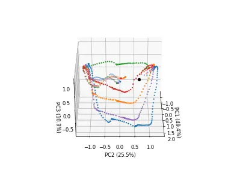

# Overview {#overview}

Because CAE-RNN trains the image feature extraction part (CAE) and the time series learning part (RNN) independently, parameter adjustment and model training time have been issues.
Furthermore, CAE extracts image features that are specialized for dimensional compression of image information, not the image features that are necessarily appropriate for generating robot motions.
Therefore, CNNRNN is a motion generation model that can automatically extract image features important for motion generation by simultaneously learning (end-to-end learning) the image feature extraction part (CAE) and the time series learning part (RNN).
This allows the robot to focus only on objects that are important to the task and generate motions that are more robust to background changes than CAE-RNN [@ito2020visualization].

{: .center}


<!-- #################################################################################################### -->
----
## Files {#files}
The programs and folders used in CNNRNN are as follows:

- **bin/train.py**: Programs to load data, train, and save models.
- **bin/test.py**: Program to perform off-line inference of models using test data (images and joint angles) and visualize inference results.
- **bin/test_pca_cnnrnn.py**: Program to visualize the internal state of RNN using Principal Component Analysis.
- **libs/fullBPTT.py**: Back propagation class for time series learning.
- **log**: Folder to store weights, learning curves, and parameter information.
- **output**: Save inference results.


<!-- #################################################################################################### -->
----
## Model {#model}
CNNRNN is a motion generation model capable of learning and inference of multimodal time series data. It predicts the image `y_image` and joint angle `y_joint` at the next time $t+1$ based on the image `xi`, joint angle `xv` and state `state` at the previous time $t$.

```python title="<a href=https://github.com/ogata-lab/eipl/blob/master/eipl/model/CNNRNN.py>[SOURCE] CNNRNN.py</a>" linenums="1" hl_lines="50-51"
class CNNRNN(nn.Module):
    def __init__(self,
                 rec_dim=50,
                 joint_dim=8,
                 feat_dim=10):
        super(CNNRNN, self).__init__()

        # Encoder
        self.encoder_image = nn.Sequential(
            nn.Conv2d(3,  64, 3, 2, 1), nn.Tanh(),
            nn.Conv2d(64, 32, 3, 2, 1), nn.Tanh(),
            nn.Conv2d(32, 16, 3, 2, 1), nn.Tanh(),
            nn.Conv2d(16, 12, 3, 2, 1), nn.Tanh(),
            nn.Conv2d(12, 8,  3, 2, 1), nn.Tanh(),
            nn.Flatten(),
            nn.Linear(8*4*4, 50),   nn.Tanh(),
            nn.Linear(50, feat_dim),nn.Tanh()
        )

        # Recurrent
        rec_in = feat_dim + joint_dim
        self.rec = nn.LSTMCell(rec_in, rec_dim )

        # Decoder for joint angle
        self.decoder_joint = nn.Sequential(
            nn.Linear(rec_dim, joint_dim),
            nn.Tanh()
        )
        
        # Decoder for image
        self.decoder_image = nn.Sequential(
            nn.Linear(rec_dim, 8*4*4), nn.Tanh(),
            nn.Unflatten(1, (8,4,4)), 
            nn.ConvTranspose2d(8, 12, 3, 2, padding=1, output_padding=1), nn.Tanh(),
            nn.ConvTranspose2d(12,16, 3, 2, padding=1, output_padding=1), nn.Tanh(),
            nn.ConvTranspose2d(16,32, 3, 2, padding=1, output_padding=1), nn.Tanh(),
            nn.ConvTranspose2d(32,64, 3, 2, padding=1, output_padding=1), nn.Tanh(),
            nn.ConvTranspose2d(64, 3, 3, 2, padding=1, output_padding=1), nn.Tanh()
        )
    
    def forward(self, xi, xv, state=None):
        # Encoder
        im_feat = self.encoder_image(xi)
        hid = torch.concat([im_feat, xv], -1)

        # Recurrent
        rnn_hid = self.rec(hid, state)

        # Decoder
        y_joint = self.decoder_joint(rnn_hid[0])
        y_image = self.decoder_image(rnn_hid[0])

        return y_image, y_joint, rnn_hid
```


<!-- #################################################################################################### -->
----
## Backpropagation Through Time {#bptt}
Backpropagation Through Time (BPTT) is used as the error back propagation algorithm for time series learning.
The details of BPTT have already been described in SARNN, please refer to [here](../../model/SARNN#bptt).

```python title="<a href=https://github.com/ogata-lab/eipl/blob/master/eipl/tutorials/cnnrnn/libs/fullBPTT.py>[SOURCE] fullBPTT.py</a>" linenums="1" hl_lines="54"
class fullBPTTtrainer:
    def __init__(self,
                model,
                optimizer,
                loss_weights=[1.0, 1.0],
                device='cpu'):

        self.device = device
        self.optimizer = optimizer
        self.loss_weights = loss_weights
        self.model = model.to(self.device)

    def save(self, epoch, loss, savename):
        torch.save({
                    'epoch': epoch,
                    'model_state_dict': self.model.state_dict(),
                    'train_loss': loss[0],
                    'test_loss': loss[1],
                    }, savename)

    def process_epoch(self, data, training=True):

        if not training:
            self.model.eval()

        total_loss = 0.0
        for n_batch, ((x_img, x_joint), (y_img, y_joint)) in enumerate(data):
            x_img = x_img.to(self.device)
            y_img = y_img.to(self.device)
            x_joint = x_joint.to(self.device)
            y_joint = y_joint.to(self.device)

            state = None
            yi_list, yv_list = [], []
            T = x_img.shape[1]
            for t in range(T-1):
                _yi_hat, _yv_hat, state = self.model(x_img[:,t], x_joint[:,t], state)
                yi_list.append(_yi_hat)
                yv_list.append(_yv_hat)

            yi_hat = torch.permute(torch.stack(yi_list), (1,0,2,3,4) )
            yv_hat = torch.permute(torch.stack(yv_list), (1,0,2) )
            loss   = self.loss_weights[0]*nn.MSELoss()(yi_hat, y_img[:,1:] ) + self.loss_weights[1]*nn.MSELoss()(yv_hat, y_joint[:,1:] )
            total_loss += loss.item()

            if training:
                self.optimizer.zero_grad(set_to_none=True)
                loss.backward()
                self.optimizer.step()

        return total_loss / (n_batch+1)
```


<!-- #################################################################################################### -->
----
## Training {#train}
The main program `train.py` is used to train CNNRNN.
When the program is run, the trained weights (pth) and Tensorboard log files are saved in the `log` folder.
Please [see](https://github.com/ogata-lab/eipl/blob/master/eipl/tutorials/cnnrnn/bin/train.py) the comments in the code for a detailed description of how the program works.


```bash
$ cd eipl/tutorials/cnnrnn/
$ python3 ./bin/train.py
[INFO] Set tag = 20230514_1958_07
================================
batch_size : 5
device : 0
epoch : 100000
feat_dim : 10
img_loss : 1.0
joint_loss : 1.0
log_dir : log/
lr : 0.001
model : CNNRNN
optimizer : adam
rec_dim : 50
stdev : 0.02
tag : 20230514_1958_07
vmax : 1.0
vmin : 0.0
================================
0%|               | 83/100000 [05:07<99:16:42,  3.58s/it, train_loss=0.0213, test_loss=0.022
```


<!-- #################################################################################################### -->
----
## Inference {#inference}
Check that CNNRNN has been properly trained using the test program `test.py`.
The arguments `filename` is the path of the trained weights file, `idx` is the index of the data you want to visualize,
`input_param` is the mixing coefficient for inference, and more info are [here](../model/test.md).

```bash
$ cd eipl/tutorials/cnnrnn/
$ python3 bin/test.py --filename ./log/20230514_1958_07/CNNRNN.pth --idx 4 --input_param 1.0

images shape:(187, 128, 128, 3), min=0, max=255
joints shape:(187, 8), min=-0.8595600128173828, max=1.8292399644851685
loop_ct:0, joint:[ 0.00226304 -0.7357931  -0.28175825  1.2895856   0.7252841   0.14539993
-0.0266939   0.00422328]
loop_ct:1, joint:[ 0.00307412 -0.73363686 -0.2815826   1.2874944   0.72176594  0.1542334
-0.02719587  0.00325996]
.
.
.

$ ls ./output/
CNNRNN_20230514_1958_07_4_1.0.gif
```

The following figure shows the results of inference at [unlearned position](../teach/overview.md#task).
From left to right are the input image, the predicted image, and the predicted joint angles (dotted lines are true values).
CNNRNN predicts the next time based on the extracted image features and robot joint angles.
It is expected that the image features include information such as the color and position of the grasped object, and it is also important that the predicted image and robot joint angle are predicted appropriately as a set.
However, experiments show that while the joint angles are appropriately predicted, only the robot hand is generated in the predicted image.
Therefore, it is difficult to generate flexible motions based on object positions because the image features contain "only" information on the robot hand.

{: .center}


<!-- #################################################################################################### -->
----
## Principal Component Analysis {#pca}
The following figure shows the results of visualizing the internal state of CNNRNN using principal component analysis.
Each dotted line shows the time-series change of the internal state of CNNRNN, and the internal state transitions sequentially starting from the black circle.
The color of each attractor is [object position](../teach/overview.md#task), where blue, orange, and green correspond to teaching positions A, C, and E, and red and purple correspond to unlearned positions B and D.
Since the attractors are self-organized (aligned) for each teaching position, it can be said that properly learned movements can be generated at the teaching positions.
On the other hand, the attractors at the unteaching position are attracted to the attractors at the teaching position, and thus cannot generate interpolated motions.
This is due to the fact that the position information of the grasped object could not be extracted as image features.

{: .center}


<!-- #################################################################################################### -->
----
## Model Improvement {#improvement}
In CAE-RNN, generalization performance was ensured by learning various object position information using data augmentation. On the other hand, since CNNRNN learns images and joint angle information at the same time, the data augmentation method for robot joint angles corresponding to changes in image position is a challenge. The following three solutions can be proposed to obtain position generalization performance with CNNRNNs.

1. **Pre-training**

    Only the CAE portion of the CNNRNN is extracted and pre-trained.
    By learning only the image information using data augmentation, CAE can extract a variety of object location information.
    Then, end-to-end learning is performed using the pre-trained weights to map images to joint angles.
    However, since CAE needs to be trained in advance, the training man-hours are equivalent to those of CAE-RNN, so the benefit of CNNRNN is small.


2. **Layer Normalization**

    CAE-RNN used `BatchNormalization` [@ioffe2015batch] as a normalization method to make CAE training stable and fast.
    However, BatchNormalization has the issues that learning becomes unstable when the batch of dataset is small and it is difficult to apply to recursive neural networks.
    Therefore, we will improve generalization performance by using `Layer Normalization` [@ba2016layer], which can stably train on small batches of data sets and time-series data.

    The following figure visualizes the internal state of [CNNRNNLN](https://github.com/ogata-lab/eipl/blob/master/eipl/model/CNNRNNLN.py) using principal component analysis.
    The self-organization (alignment) of attractors for each object position allows the robot to properly generate motion even at unlearned positions.

    {: .center}


3. **Spatial Attention**

    Because CAE-RNN and CNNRNN were learning motions based on image features containing various information in the image (position, color, shape, background, lighting conditions, etc.), robustness during motion generation was an issue.
    Therefore, it is possible to improve robustness by learning spatial coordinates and robot joint angles using a spatial attention mechanism that "explicitly" extracts spatial coordinates of locations (work objects and arms) important to the task from images.
    For more information on the spatial attention mechanism, see [here](../model/SARNN.md).


