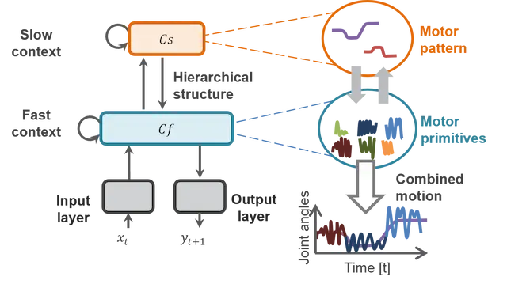

# Overview

MTRNN is a type of RNN consisting of a hierarchical neuron group with different firing rates [@yamashita2008emergence].
It consists of three layers: an IO layer and context layers (Cf and Cs layers) with different firing rates (time constants), each with recursive inputs.
The time constants increase in value from the Cf layer to the Cs layer, and the response speed to the input becomes slower.
The input information is output at the Output layer via the Cf and Cs layers.
There is no direct coupling between the IO and Cs layers, and they interact through the Cf layer.
The MTRNN enables the robot to learn behaviors, with the Cf layer representing the behavior primitives and the Cs layer representing (learning) the combination of these primitives.
Compared to LSTM, MTRNN is more interpretable and is often used in the Ogata lab.

{: .center}

::: MTRNN.MTRNNCell
    handler: python
    options:
      show_root_heading: true
      show_source: true

::: MTRNN.BasicMTRNN
    handler: python
    options:
      show_root_heading: true
      show_source: true
