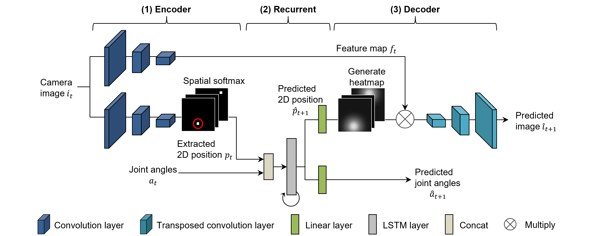
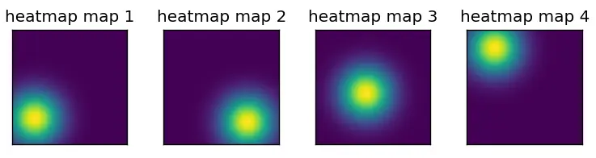

# 概要 {#model_overview}

SARNNは、画像からタスクに重要な位置（作業対象物やアーム）の空間座標を「明示的」に抽出し、その座標とロボットの関節角度を学習することで、対象物の位置変化に対するロバスト性を大幅に向上させた[@ichiwara2022contact]。
下図はSARNNのネットワーク構造を示しており、カメラ画像 $i_t$ から画像特徴量 $f_t$ と物体の位置座標 $p_t$ を抽出するEncoder部、ロボットの関節角度 $a_t$ と物体の位置情報の時系列変化を学習するRecurrent部、そして画像特徴量 $f_t$ とヒートマップ $\hat h_{t+1}$ に基づいて画像を再構成するDecoder部から構成される。
Encoder上段とDecoderのCNN 層（Convolution layer and Transposed convolutional layer）は、画像の特徴量抽出と再構成をすることで物体の色や形に関する情報を抽出する。
下段のCNNはSpatial Softmax層を用いることで物体の2D位置情報を抽出する。
Recurrent部は、物体の位置情報 $p_{t+1}$ のみを予測しているため、Decoderで画像を再構成するだけの十分な情報は含まれていない。
そこで予測位置情報 $p_{t+1}$ を中心としたヒートマップ $\hat h_{t+1}$ を生成し、上段のCNNで抽出した画像特徴量 $f_t$ と掛け合わせることで、予測注意点の周辺情報に基づいて予測画像 $\hat i_{t+1}$ を生成する。

ここでは、SARNNの特徴的な機能である[空間的注意機構](#spatial_softmax) 、[ヒートマップ生成機構](#heatmap)、[誤差スケジューラ](#loss_scheduler)、[誤差逆伝播法](#bptt)の実装方法とモデルクラスを示す。


{: .center}


<!-- #################################################################################################### -->
----
## 空間的注意機構 {#spatial_softmax}
空間的注意機構は、特長マップにSoftmaxをかけ合わせることで重要な情報（ピクセル値が大きい）を強調したのちに、Position-Encodingを用いて強調されたピクセルの位置情報を抽出する。
下図は、空間的注意機構の処理結果を示しており、ランダムに生成した2つのガウス分布を用いて生成した「疑似」特徴マップ対し、Softmaxをかけ合わせることで重要な位置情報（赤点）を抽出する。
このとき、CNNの特徴マップには多様な情報が含まれているため、単純にSoftmaxをかけ合わせただけでは強調されないため、[温度付きSoftmax](https://en.wikipedia.org/wiki/Softmax_function) を用いることが重要である。
温度付きSoftmaxの効果については、以下サンプルプログラムのパラメータ `temperature` を調整して確認するとよい。
また図中の赤点はSpatialSoftmaxで抽出した位置を表しており、一方のガウス分布の中心に生成されていることから適切に位置情報が抽出できている。

{: .center}

```python title="<a href=https://github.com/ogata-lab/eipl/blob/master/eipl/layer/SpatialSoftmax.py>[SOURCE] SpatialSoftmax.py</a>" linenums="1"
class SpatialSoftmax(nn.Module):
    def __init__(self, width: int, height: int, temperature=1e-4, normalized=True):
        super(SpatialSoftmax, self).__init__()
        self.width = width
        self.height = height
        if temperature is None:
            self.temperature = torch.nn.Parameter(torch.ones(1))
        else:
            self.temperature = temperature

        _, pos_x, pos_y = create_position_encoding(width, height, normalized=normalized)
        self.register_buffer("pos_x", pos_x)
        self.register_buffer("pos_y", pos_y)

    def forward(self, x):
        batch_size, channels, width, height = x.shape
        assert height == self.height
        assert width == self.width

        # flatten, apply softmax
        logit = x.reshape(batch_size, channels, -1)
        att_map = torch.softmax(logit / self.temperature, dim=-1)

        # compute expectation
        expected_x = torch.sum(self.pos_x * att_map, dim=-1, keepdim=True)
        expected_y = torch.sum(self.pos_y * att_map, dim=-1, keepdim=True)
        keys = torch.cat([expected_x, expected_y], -1)

        # keys [[x,y], [x,y], [x,y],...]
        keys = keys.reshape(batch_size, channels, 2)
        att_map = att_map.reshape(-1, channels, width, height)
        return keys, att_map
```


<!-- #################################################################################################### -->
----
## ヒートマップ生成機構 {#heatmap}
ヒートマップ生成機構は、位置情報（特定のピクセル座標）を中心としたヒートマップを生成する。
下図は、空間的注意機構で抽出した位置（図中赤点）を中心にヒートマップ生成機構が生成したヒートマップを表している。
ヒートマップの大きさは、パラメータ `heatmap_size` で設定することが可能であり、ヒートマップサイズが小さいと注意点近傍の情報のみ、大きいと周辺の情報も一部加味して画像生成を行う。
なお、ヒートマップがあまりにも小さいと適切な予測画像 $\hat i_{t+1}$ の生成ができない、また大きすぎると周囲の環境変化（背景や障害物）に敏感になるためパラメータの調整が必要である。

{: .center}


```python title="<a href=https://github.com/ogata-lab/eipl/blob/master/eipl/layer/SpatialSoftmax.py>[SOURCE] InverseSpatialSoftmax.py</a>" linenums="1"
class InverseSpatialSoftmax(nn.Module):
    def __init__(self, width: int, height: int, heatmap_size=0.1, normalized=True):
        super(InverseSpatialSoftmax, self).__init__()

        self.width = width
        self.height = height
        self.normalized = normalized
        self.heatmap_size = heatmap_size

        pos_xy, _, _ = create_position_encoding(width, height, normalized=normalized)
        self.register_buffer("pos_xy", pos_xy)

    def forward(self, keys):
        squared_distances = torch.sum(
            torch.pow(self.pos_xy[None, None] - keys[:, :, :, None, None], 2.0), axis=2
        )
        heatmap = torch.exp(-squared_distances / self.heatmap_size)
        return heatmap
```


<!-- #################################################################################################### -->
----
## 誤差スケジューラ {#loss_scheduler} 
誤差スケジューラとは、注意点の予測誤差をエポックに応じて徐々に重み付けする `callback` であり、SARNNを学習させる上で重要な機能である。
下図は引数 `curve_name` ごとの重み付け曲線を示しており、横軸はエポック数、縦軸は重み付けの値である。
誤差の重み付けは0から始まり、 `decay_end` （例：100）で設定したエポックで重み付けの最大値（例：0.1）を返す。
なお、重み付け最大値は `__call__` メソッドで指定する。
本クラスでは、図中に示す5種類の曲線(線形補間、S字補完、逆S字補完、減速補完、加速補完)に対応している。

{: .center}


SARNNの学習に誤差スケジューラを用いる理由として、学習初期段階ではCNNのフィルタを「自由に」学習させることが目的である。
SARNNのEncoderとDecoderはランダムに初期化されているため、学習初期段階では視覚画像中の特徴量を適切に抽出/学習できていない。
そのような状況で得られた注意点予測誤差を逆伝搬すると作業対象物に適切に注意点が向かず、「予測画像誤差」を最小にするような注意点が学習されてしまう。
そのため、学習初期段階では注意点の予測誤差は無視し、CNNのフィルタが特徴量を学習し終えた頃に注意点予測の誤差を学習させることで、作業に重要な対象物にのみ着目した注意点を獲得することが可能である。
`decay_end` がCNNの学習タイミングを調整しており、通常1000エポック程度を設定しているが、タスクによっては調整が必要である。


```python title="<a href=https://github.com/ogata-lab/eipl/blob/master/eipl/utils/callback.py>[SOURCE] callback.py</a>" linenums="1"
class LossScheduler:
    def __init__(self, decay_end=1000, curve_name="s"):
        decay_start = 0
        self.counter = -1
        self.decay_end = decay_end
        self.interpolated_values = self.curve_interpolation(
            decay_start, decay_end, decay_end, curve_name
        )

    def linear_interpolation(self, start, end, num_points):
        x = np.linspace(start, end, num_points)
        return x

    def s_curve_interpolation(self, start, end, num_points):
        t = np.linspace(0, 1, num_points)
        x = start + (end - start) * (t - np.sin(2 * np.pi * t) / (2 * np.pi))
        return x

    def inverse_s_curve_interpolation(self, start, end, num_points):
        t = np.linspace(0, 1, num_points)
        x = start + (end - start) * (t + np.sin(2 * np.pi * t) / (2 * np.pi))
        return x

    def deceleration_curve_interpolation(self, start, end, num_points):
        t = np.linspace(0, 1, num_points)
        x = start + (end - start) * (1 - np.cos(np.pi * t / 2))
        return x

    def acceleration_curve_interpolation(self, start, end, num_points):
        t = np.linspace(0, 1, num_points)
        x = start + (end - start) * (np.sin(np.pi * t / 2))
        return x

    def curve_interpolation(self, start, end, num_points, curve_name):
        if curve_name == "linear":
            interpolated_values = self.linear_interpolation(start, end, num_points)
        elif curve_name == "s":
            interpolated_values = self.s_curve_interpolation(start, end, num_points)
        elif curve_name == "inverse_s":
            interpolated_values = self.inverse_s_curve_interpolation(start, end, num_points)
        elif curve_name == "deceleration":
            interpolated_values = self.deceleration_curve_interpolation(start, end, num_points)
        elif curve_name == "acceleration":
            interpolated_values = self.acceleration_curve_interpolation(start, end, num_points)
        else:
            assert False, "Invalid curve name. {}".format(curve_name)

        return interpolated_values / num_points

    def __call__(self, loss_weight):
        self.counter += 1
        if self.counter >= self.decay_end:
            return loss_weight
        else:
            return self.interpolated_values[self.counter] * loss_weight
```


<!-- #################################################################################################### -->
----
## 誤差逆伝播法 {#bptt}
モデルの時系列学習を行うための誤差逆伝播アルゴリズムとしてBackpropagation Through Time（BPTT）を用いる[@rumelhart1986learning]。
RNNでは、各時刻での内部状態 $h_{t}$ は、前時刻の時刻 $t-1$ の内部状態 $h_{t-1}$ に依存する。
BPTTでは、各時刻での誤差を計算し、それを遡って勾配を計算することで、各時刻でのパラメータの更新を行う。
具体的には、画像$i_t$と関節角度 $a_{t}$ をモデルに入力し、次状態（$\hat i_{t+1}$, $ \hat a_{t+1}$）を出力（予測）する。
全シーケンスの予測値と真値（$f_{t+1}$, $a_{t+1}$）の平均二乗誤差 `nn.MSELoss` を計算し、誤差値`loss`に基づいて誤差伝番を行う。
このとき、各時刻のパラメータが、その時刻より後のすべての時刻で使用されるため、時間的な展開を行いながら逆伝播を行う。

47-54行目に示すように、SARNNは画像誤差と関節角度誤差に加え、注意点の予測誤差も計算する。
注意点の真値は存在しないため、双方向誤差[@hiruma2022deep] を用いて注意点の学習を行う。
具体的には時刻 $t$ でRNNが予測した注意点 $ \hat p_{t+1}$ と時刻 $t+1$ でCNNが抽出した注意点 $p_{t+1}$ が一致するように誤差を計算する。
この双方向誤差に基づいて、LSTMで注意点と関節角度の時系列関係を学習することで、冗長な画像予測を排除するだけでなく、動作予測に重要な注意点を予測するように誘導する。

また`loss_weights`は、各モダリティ誤差の重みづけを行っており、どのモダリティを重点的に学習するかを決定する。 
深層予測学習では、予測された関節角度がロボットの動作指令に直結するため関節角度を重点的に学習させる。
しかし逆に画像情報の学習が不十分な場合、画像と関節角度の統合学習が適切に行えない（画像情報に対応した関節角度予測が困難になる）ため、
重み付け係数はモデルやタスクに応じて調整することが求められる。
これまでの経験上、重み付け係数は全て1.0、もしくは画像のみ0.1にすることが多い。

```python title="<a href=https://github.com/ogata-lab/eipl/blob/master/eipl/tutorials/sarnn/libs/fullBPTT.py>[SOURCE] fullBPTT.py</a>" linenums="1" hl_lines="6 47-54"
class fullBPTTtrainer:
    def __init__(self, model, optimizer, loss_weights=[1.0, 1.0], device="cpu"):
        self.device = device
        self.optimizer = optimizer
        self.loss_weights = loss_weights
        self.scheduler = LossScheduler(decay_end=1000, curve_name="s")
        self.model = model.to(self.device)

    def save(self, epoch, loss, savename):
        torch.save(
            {
                "epoch": epoch,
                "model_state_dict": self.model.state_dict(),
                "train_loss": loss[0],
                "test_loss": loss[1],
            },
            savename,
        )

    def process_epoch(self, data, training=True):
        if not training:
            self.model.eval()

        total_loss = 0.0
        for n_batch, ((x_img, x_joint), (y_img, y_joint)) in enumerate(data):
            x_img = x_img.to(self.device)
            y_img = y_img.to(self.device)
            x_joint = x_joint.to(self.device)
            y_joint = y_joint.to(self.device)

            state = None
            yi_list, yv_list = [], []
            dec_pts_list, enc_pts_list = [], []
            T = x_img.shape[1]
            for t in range(T - 1):
                _yi_hat, _yv_hat, enc_ij, dec_ij, state = self.model(
                    x_img[:, t], x_joint[:, t], state
                )
                yi_list.append(_yi_hat)
                yv_list.append(_yv_hat)
                enc_pts_list.append(enc_ij)
                dec_pts_list.append(dec_ij)

            yi_hat = torch.permute(torch.stack(yi_list), (1, 0, 2, 3, 4))
            yv_hat = torch.permute(torch.stack(yv_list), (1, 0, 2))

            img_loss = nn.MSELoss()(yi_hat, y_img[:, 1:]) * self.loss_weights[0]
            joint_loss = nn.MSELoss()(yv_hat, y_joint[:, 1:]) * self.loss_weights[1]
            # Gradually change the loss value using the LossScheluder class.
            pt_loss = nn.MSELoss()(
                torch.stack(dec_pts_list[:-1]), torch.stack(enc_pts_list[1:])
            ) * self.scheduler(self.loss_weights[2])
            loss = img_loss + joint_loss + pt_loss
            total_loss += loss.item()

            if training:
                self.optimizer.zero_grad(set_to_none=True)
                loss.backward()
                self.optimizer.step()

        return total_loss / (n_batch + 1)
```


<!-- #################################################################################################### -->
---- 
::: model.SARNN
    handler: python
    options:
      show_root_heading: true
      show_source: true
