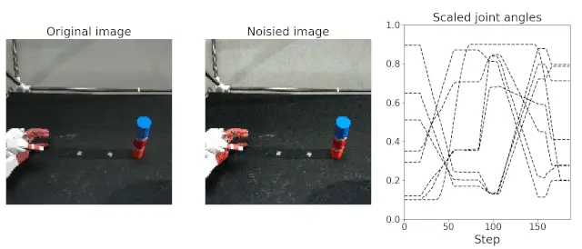

EIPLでは、Pytorchが標準で提供する`Dataset`クラスを継承した、ロボット動作学習のための`MultimodalDataset`クラスを提供している。
本クラスは毎エポック、モデルへの入力データ `x_data` と真値 `y_data` のペアを返す。
入力データ`x_data`は画像と関節角度のペアになっており、毎エポックデータ拡張を行う。
入力画像には、照明変化に対するロバスト性を向上させるために輝度やコントラストなどをランダムに付与し、入力関節角度には、手先位置誤差に対するロバスト性を向上させるためにガウシアンノイズを付与している。
一方で出力データには一切ノイズを加えていない。
モデルはノイズが混じった入力データから、ノイズを無視した状況（内部表現）を学習することで、推論時は実世界のノイズに対しロバストな動作生成が可能になる。

以下は、AIRECを用いて収集した[物体把持タスク](../teach/overview.md)を例に、`MultimodalDataset`クラスの利用方法を示している。
`MultimodalDataset`クラスに5次元の画像時系列データ（データ数、時系列長、チャネル、縦、横）と3次元の関節角度時系列データ（データ数、時系列長、関節数）を渡すことで自動的にデータ拡張などが行われる。
なお、`SampleDownloader`はEIPLのサンプルデータのダウンロードを行うクラスであり、必ずしも必要ではない。
`numpy.load`関数などを用いて、自作データセットを直接読み込んでも良い。


```python title="サンプルデータセットの使い方" linenums="1"
from eipl.data import SampleDownloader, MultimodalDataset

# サンプルデータをダウンロードし、正規化
grasp_data = SampleDownloader("airec", "grasp_bottle", img_format="CHW")
images, joints = grasp_data.load_norm_data("train", vmin=0.1, vmax=0.9)

# 画像と関節角度をDatasetクラスに渡す
multi_dataset = MultimodalDataset(images, joints)

# 入出力データを戻り値として返す。
x_data, y_data = multi_dataset[1]
```

下図は`MultimodalDataset`クラスが返したロボットのカメラ画像を示しており、
左から順に右はノイズの無い画像、ノイズが付与された画像、そしてロボット関節角度である。
毎エポックランダムなノイズが画像に付与されるため、モデルは多様な視覚状況を学習する。
またロボット関節角度の黒色点線は、ノイズがないオリジナル関節角度、色付き線はガウシアンノイズが付与された関節角度である。


{: .center}


!!! note
    
    Proxyなどが原因でデータセットが取得できない場合は、
    [ここから](https://dl.dropboxusercontent.com/s/5gz1j4uzpzhnttt/grasp_bottle.tar)データセットを手動でダウンロードし、
    `~/.eipl/` フォルダ内に保存してください。
        ```bash            
        $ cd ~/
        $ mkdir .eipl
        $ cd .eipl
        $ # copy grasp_bottle.tar to ~/.eipl/ directory
        $ tar xvf grasp_bottle.tar
        $ ls grasp_bottle/*
        grasp_bottle/joint_bounds.npy
        ```


<!-- #################################################################################################### -->
---- 
::: dataloader.MultimodalDataset
    handler: python
    options:
      show_root_heading: true
      show_source: true
