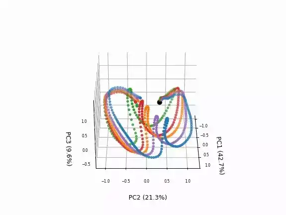

# 推論 {#test}
<!-- #################################################################################################### -->
## オフライン推論 
SARNNが適切に学習されたかを確認するために、テストプログラム `test.py` を用いて検証する。
引数 `filename` は学習済みの重みファイルのパス、 `idx` は可視化したいデータのインデックスである。
`input_param`は実世界のノイズに対し安定的な動作を生成するための混合係数であり、時刻$t$のセンサ情報に、前時刻$t-1$のモデルの予測値を一定の割合で混合した値をモデルに入力する。
本処理はローパスフィルタと同等であり、ロボットのセンサ値にノイズが乗っても、 前時刻の予測値を補助的に利用することで、安定した動作指令の予測が可能である。
なお、混合係数が小さ過ぎると実世界のセンサ情報に基づいて動作を修正することが困難になるため、位置変化に対するロバスト性が低下することに注意されたい。


```bash
$ cd eipl/tutorials/sarnn/
$ python3 bin/test.py --filename ./log/20230521_1247_41/SARNN.pth --idx 4 --input_param 1.0

images shape:(187, 128, 128, 3), min=0, max=255
joints shape:(187, 8), min=-0.8595600128173828, max=1.8292399644851685
loop_ct:0, joint:[ 0.00226304 -0.7357931  -0.28175825  1.2895856   0.7252841   0.14539993
-0.0266939   0.00422328]
loop_ct:1, joint:[ 0.00307412 -0.73363686 -0.2815826   1.2874944   0.72176594  0.1542334
-0.02719587  0.00325996]
.
.
.

$ ls output/
SARNN_20230521_1247_41_4_1.0.gif
```

下図に[未学習位置（D地点）](../teach/overview.md#task)での推論結果を示す。
左から入力画像、予測画像、そして予測関節角度（点線は真値）である。
入力画像中の青点は画像から抽出した注意点、そして赤点はRNNが予測した注意点であり、ロボットハンドと把持対象物に着目しながら関節角度を予測していることがわかる。

{: .center}


<!-- #################################################################################################### -->
----
## 主成分分析 {#pca}
深層予測学習では、学習済みモデルが汎化性能を備えているかを事前検討するために、主成分分析 [@hotelling1933analysis] を用いて内部表現を可視化することを推奨する。
小データで汎化動作を獲得するために、RNNの内部状態に動作を埋め込む必要があり、教示動作ごとに内部状態が自己組織化（構造化）されることが望ましい。
以降、主成分分析を用いてRNNの内部状態を低次元に圧縮し、データの特徴を表す要素（第1ー第3主成分）を可視化することで、感覚運動情報（画像・関節角度）がどのようにして表現されているのかを検証する。

以下のプログラムは、推論および主成分分析の処理を一部抜粋したものである。
初めに、モデルにテストデータを入力し、各時刻におけるRNNの内部状態 `state` をリストとして保存する。
[LSTM](https://pytorch.org/docs/stable/generated/torch.nn.LSTM.html) の場合、`hidden state` と `cell state` が `state` して返ってくるため、ここでは `hidden state` を対象に可視化解析する。
次に、物体位置毎における内部状態を比較するために`hidden state`の形状、［データ数、時系列長、stateの次元数］から［データ数×時系列長、stateの次元数］に変形する。
最後に、12行目に示すように主成分分析を適用することで、高次元な `hidden state` を低次元な情報（3次元）に圧縮する。
圧縮された主成分 `pca_val` を元の形状［データ数、時系列長、3次元］に戻し、物体位置ごとに色付けて3D空間にプロットすることで、物体位置と内部状態の関係を可視化できる。

```python title="<a href=https://github.com/ogata-lab/eipl/blob/master/eipl/tutorials/sarnn/bin/test_pca_sarnn.py>[SOURCE] test_pca_rnn.py</a>" linenums="1" hl_lines="12"
states = tensor2numpy( states )
# Reshape the state from [N,T,D] to [-1,D] for PCA of RNN.
# N is the number of datasets
# T is the sequence length
# D is the dimension of the hidden state
N,T,D  = states.shape
states = states.reshape(-1,D)

# plot pca
loop_ct = float(360)/T
pca_dim = 3
pca     = PCA(n_components=pca_dim).fit(states)
pca_val = pca.transform(states)
# Reshape the states from [-1, pca_dim] to [N,T,pca_dim] to
# visualize each state as a 3D scatter.
pca_val = pca_val.reshape( N, T, pca_dim )

fig = plt.figure(dpi=60)
ax = fig.add_subplot(projection='3d')

def anim_update(i):
    ax.cla()
    angle = int(loop_ct * i)
    ax.view_init(30, angle)

    c_list = ['C0','C1','C2','C3','C4']
```


主成分分析を用いた内部状態の可視化プログラムには `test_pca_sarnn.py` を用いる。引数 filename は学習済みの重みファイルのパスである。

```bash
$ cd eipl/tutorials/sarnn/
$ python3 ./bin/test_pca_sarnn.py --filename log/20230521_1247_41/SARNN.pth
$ ls output/
PCA_SARNN_20230521_1247_41.gif
```

下図はSARNNの可視化結果であり、各点線は内部状態の時系列変化を示してている。
各アトラクタの色は[物体位置](../teach/overview.md#task)に対応しており、青、オレンジ、緑は教示位置A、C、Eに、赤、紫は未学習位置B、Dである。
物体位置に応じてアトラクタが自己組織化（整列）していることから、物体位置に応じた動作が学習（記憶）されていると言える。
特に未学習位置のアトラクタは、教示位置の間に生成されていることから、物体位置が異なる把持動作を複数回教示し学習させるだけで、未学習の内挿動作を生成することが可能である。


{: .center}


<!-- #################################################################################################### -->
----
## オンライン動作生成 {#online}
以下に疑似コードを用いて、実ロボットを用いたオンライン動作生成方法について述べる。
ロボットは、ステップ2-5をの処理を、指定したサンプリングレートで繰り返し行うことで、センサ情報に基づいて逐次動作を生成することが可能である。

1. **モデル読み込み（23行目）**

    モデルの定義を行った後に、学習済みの重みを読み込む。

2. **センサ情報の取得、正規化（38行目）**

    ロボットセンサ情報を取得し、正規化処理を行う。例えばロボットシステムに ROS を用いている場合、 Subscribe した画像と関節角度を `raw_image`, `raw_joint`とする。 

3. **推論（51行目）**

    正規化済みの画像`x_img`、関節角度`x_joint`を用いて、次時刻の画像`y_image`と関節角度`y_joint`を予測する。そして、各予測値を逆正規化することで、予測画像`pred_image`と予測関節角度`pred_joint`を計算する。
    

4. **指令送信（61行目）**

    予測関節角度`pred_joint`をロボットの動作指令とするとことで、ロボットは逐次動作を生成することが可能である。ROSの場合、関節角度をモータにPublishすることでロボットは指令値に基づいて各モータを制御する。


5. **スリープ（65行目）**

    最後に指定したサンプリングレートで推論を行うために、スリープ処理を入れることでタイミング調整を行う。なお、サンプリングレートは学習データ収集時と同じにする。


```python title="online.py" linenums="1" hl_lines="23-26 38-44 51-52 61-63 65-67"
parser = argparse.ArgumentParser()
parser.add_argument("--model_pth", type=str, default=None)
parser.add_argument("--input_param", type=float, default=0.8)
args = parser.parse_args()

# restore parameters
dir_name = os.path.split(args.model_pth)[0]
params = restore_args(os.path.join(dir_name, "args.json"))

# load dataset
minmax = [params["vmin"], params["vmax"]]
joint_bounds = np.load(os.path.join(os.path.expanduser("~"), ".eipl/grasp_bottle/joint_bounds.npy"))

# define model
model = SARNN(
    rec_dim=params["rec_dim"],
    joint_dim=8,
    k_dim=params["k_dim"],
    heatmap_size=params["heatmap_size"],
    temperature=params["temperature"],
)

# load weight
ckpt = torch.load(args.model_pth, map_location=torch.device("cpu"))
model.load_state_dict(ckpt["model_state_dict"])
model.eval()

# Inference
# Set the inference frequency; for a 10-Hz in ROS system, set as follows.
freq = 10  # 10Hz
rate = rospy.Rate(freq)
image_list, joint_list = [], []
state = None
nloop = 200  # freq * 20 sec
for loop_ct in range(nloop):
    start_time = time.time()

    # load data and normalization
    raw_images, raw_joint = robot.get_sensor_data()
    x_img = raw_images[loop_ct].transpose(2, 0, 1)
    x_img = torch.Tensor(np.expand_dims(x_img, 0))
    x_img = normalization(x_img, (0, 255), minmax)
    x_joint = torch.Tensor(np.expand_dims(raw_joint, 0))
    x_joint = normalization(x_joint, joint_bounds, minmax)

    # closed loop
    if loop_ct > 0:
        x_img = args.input_param * x_img + (1.0 - args.input_param) * y_image
        x_joint = args.input_param * x_joint + (1.0 - args.input_param) * y_joint

    # predict rnn
    y_image, y_joint, state = rnn_model(x_img, x_joint, state)

    # denormalization
    pred_image = tensor2numpy(y_image[0])
    pred_image = deprocess_img(pred_image, cae_params["vmin"], cae_params["vmax"])
    pred_image = pred_image.transpose(1, 2, 0)
    pred_joint = tensor2numpy(y_joint[0])
    pred_joint = normalization(pred_joint, minmax, joint_bounds)

    # send pred_joint to robot
    # send_command(pred_joint)
    pub.publish(pred_joint)

    # Sleep to infer at set frequency.
    # ROS system
    rate.sleep()
```
