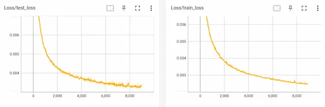

## ファイル

SARNNの学習には、EIPLリポジトリ中の[tutorial/SARNN](https://github.com/ogata-lab/eipl/tree/master/eipl/tutorials/sarnn)フォルダ内のプログラムを利用する。
各フォルダとプログラムの役割は以下の通りである。

- **bin/train.py**：データの読み込み、学習、そしてモデルの保存を行う学習プログラム
- **bin/test.py**：テストデータ（画像と関節角度）に基づいて毎時刻の動作指令値を予測し、推論結果を可視化するプログラム
- **bin/test_pca_sarnn.py**：主成分分析を用いてRNNの内部状態を可視化するプログラム
- **libs/fullBPTT.py**：時系列学習のための誤差逆伝播クラス
- **log**：学習結果として重みや学習曲線、パラメータの情報を保存
- **output**：推論結果を保存


<!-- #################################################################################################### -->
----
## モデル学習 {#train}
メインプログラム `train.py` を使用して、SARNNを学習する。
プログラムを実行すると `log` フォルダ内に学習済みの重み（pth）とTensorboardのログファイルが保存される。
このプログラムでは、コマンドライン引数を使用して、モデルの種類、エポック数、バッチサイズ、学習率、最適化手法など、学習に必要なパラメータを指定可能である。
また、EarlyStoppingライブラリを使用して、学習の早期終了タイミングを決定するだけでなく、テスト誤差が最小になった時点で重みを保存する。
プログラムの詳細な動作については、コード内のコメントを[参照](https://github.com/ogata-lab/eipl/blob/master/eipl/tutorials/sarnn/bin/train.py)ください。

```bash 
$ cd eipl/tutorials/sarnn/
$ python3 ./bin/train.py
[INFO] Set tag = "20230521_1247_41"
================================
batch_size : 5
device : 0
epoch : 100000
heatmap_size : 0.1
img_loss : 0.1
joint_loss : 1.0
k_dim : 5
log_dir : log/
lr : 0.001
model : sarnn
optimizer : adam
pt_loss : 0.1
rec_dim : 50
stdev : 0.02
tag : "20230521_1247_41"
temperature : 0.0001
vmax : 1.0
vmin : 0.0
================================
12%|████          | 11504/100000 [14:46:53<114:10:44,  4.64s/it, train_loss=0.000251, test_loss=0.000316]
```


<!-- #################################################################################################### -->
----
## 学習曲線 {#tensorboard}
TensorBoardを用いてモデルの学習状況を確認する。
重みが保存されているログフォルダを引数 `logdir` に指定することで、下図に示すような学習曲線をブラウザで見ることができる。
テストデータのlossが十分に下がっているかを曲線を見て判断する。
学習初期段階で過学習傾向がみられる場合、学習データかモデルに異常がある、もしくは初期重み（シード）が原因と考えられれる。
対策としては、学習データの正規化範囲の確認、モデル構造の確認、シード値を変えて再学習、を実施する。
TensorBoardの具体的な使い方については、[こちら](https://www.tensorflow.org/tensorboard?hl=ja)を参照ください。

```bash
$ cd eipl/tutorials/sarnn/
$ tensorboard --logdir=./log/
TensorFlow installation not found - running with reduced feature set.
Serving TensorBoard on localhost; to expose to the network, use a proxy or pass --bind_all
TensorBoard 2.12.1 at http://localhost:6006/ (Press CTRL+C to quit)
```

{: .center}

