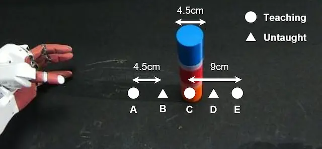

# 概要

ここでは、ROSを用いて動作教示した際のロボットセンサデータ `rosbag` から機械学習のためのデータセットの作成方法について述べる。
本章では理解を深めるために、収集済みのデータとスクリプトを
 [ダウンロード（1.3GB）](https://dl.dropboxusercontent.com/s/90wkfttf9w0bz0t/rosbag.tar) し、マニュアルに沿って実行することを推奨する。

<!-- ******************************** -->
----
## 実験タスク {#task}
東京ロボティクス社製のスマートロボット
[AIREC（AI-driven Robot for Embrace and Care）](https://airec-waseda.jp/)
を用いて、物体把持動作を教示する。
下図はタスクの概要を示しており、図中に示す教示位置（丸点3か所）での物体把持経験に基づいて、未学習位置（2か所）における汎化性能を評価する。
学習データは各教示位置でそれぞれ4回合計12データ、
テストデータは未学習位置も含む全5か所でそれぞれ1回合計5データ収集した。

{: .center}

<!-- ******************************** -->
----
## 動作教示 {#teaching}
AIRECは、以下に示すようにバイラテラル遠隔操作が可能なロボットシステムであり、
操作者はモニタに表示されたロボット視覚画像とロボットからの力覚フィードバックに基づいて動作教示を行うことで、
多自由度ロボットをより直感的に教示することが可能である。
ここでは、遠隔操作装置を用いてタスクを教示した際のロボットのセンサ情報（関節角度、カメラ画像、トルク情報など）を
`rosbag` 形式で保存し、以降では機械学習モデルのためのデータセットを作成する。

なお、このような専用デバイス無しでもロボットに動作教示することは可能である。
[OpenManipulatorを用いた動作教示セクション](./robot/overview)では、
リーダ・フォロワシステムとジョイスティックの2種類の動作教示方法とデータセットの作成方法について述べる。

<html lang="ja">
<head>
  <link rel="stylesheet" href="index.css">
</head>
<body>
  

    <iframe class="youtube" width="640" height="360" src="https://www.youtube.com/embed/ivksUcWIK4g" title="Bilateral teleoperation of a humanoid robot Dry-AIREC" frameborder="0" allow="accelerometer; autoplay; clipboard-write; encrypted-media; gyroscope; picture-in-picture" allowfullscreen></iframe>
  

</body>
</html>

