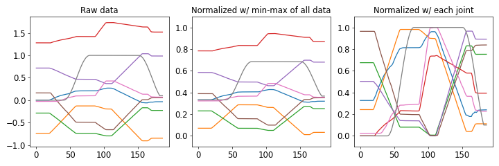
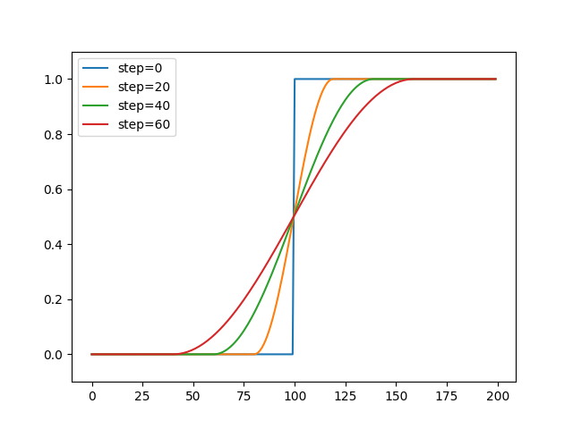

<!-- # 関節角度処理

ここでは、ノイズロバスト性や汎化性能を向上するために有効な前処理を説明する。
-->

## 関節角度正規化 {#joint_norm}

ロボットのカメラ画像は256階調（0～255 = 8bit）の整数値で表現されているため、［0, 255］から任意の範囲（例えば［0.0、1.0］）に収まるように正規化を行えば良い。
一方でロボット関節角度は、関節構造や可動範囲、さらに教示タスクによって取りうる範囲が異なる。
最も単純な正規化方法として、学習データの最大・最小値に基づいて正規化する方法が考えられるが、大きな動きをする関節に正規化範囲が引っ張られてしまい、繊細な動きを学習することが困難である。
そこで、各関節の最大・最小値に基づいて正規化することで、細かい動きも強調して学習させることが可能である。

下図は、物体把持動作時の関節角度の正規化結果を示している。
左から収集した生データ、学習データの最大・最小値に基づいて正規化（全体正規化）、各関節角度の最大・最小値に基づいて正規化（関節正規化）した結果である。
全体正規化を行った場合、生データと比較して正規化後の波形に大きな変化はなく、単純に関節角度の範囲が0.0から1.0に変換されている。
一方で関節正規化を行った場合、関節毎に正規化を行うため大まかな動き（例えば灰色波形）と細かい動き（青色波形）の両方が顕著になっている。
これにより、全体正規化よりも高精度にロボットの動作を学習することが可能である。

:download:`Download joint_normalization.py <./src/joint_norm.py>`

!!! note
    タスクによっては、全く動かないもしくは変化量がごく僅かな関節もある。そのような関節に対し関節正規化を適用した場合、正規化後の波形が大きく乱れるため学習に悪影響を及ぼす場合がある。正規化後の波形を確認の上、そのような関節波形がある場合、手動で正規化範囲を調整することを推奨する。またトルクや電流値のように、元々ノイジーなデータに対し関節正規化は適さないことに注意されたい。

----
## コサイン補完 {#cos-interpolation}
ロボットハンドの開閉コマンドや、PSD（Position Sensitive Detector）センサのように、ON/OFFで表現されるデータを学習する場合、事前に平滑化処理を行うことで学習を容易にすることが可能である。
以下は、元データ（青色矩形波）に対し平滑化処理を適用した結果であり、引数（ `step` サイズ）に応じて滑らかさを調整することが可能である。

:download:`Download cos_interpolation.py <../../eipl/utils/utils.py>`
