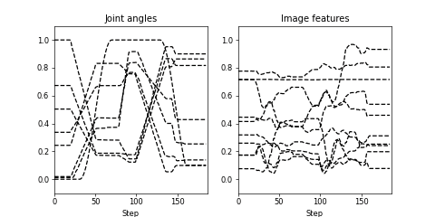

# 概要 {#cae-rnn}

CAE-RNNは、ロボットの感覚運動情報を学習するために、画像特徴抽出部と時系列学習部から構成される[@ito2022efficient] [@yang2016repeatable]。
下図は、CAE-RNNモデルのネットワーク構成を示しており、ロボットの視覚情報であるカメラ画像から画像特徴量を抽出するConvolutional Auto-Encoder(CAE)と、ロボットの身体情報である関節角と画像特徴量の時系列情報を学習するRecurrent Neural Network(RNN)から構成される。
CAE-RNNは、画像特徴量抽出部と時系列学習部を独立して学習を行うことを特徴としており、CAEとRNNの順に学習を行う。
多様な感覚運動情報を学習させることで、従来では認識困難な柔軟物体の位置、形状などの画像特徴量の抽出と、それに対応した動作を学習、生成することが可能である。
ここでは、[CAE](#cae)、[RNN](#rnn)の順にモデルの実装、推論、[内部表現解析](#rnn_pca)そしてまでの一連のプロセスについて述べる。

{: .center}


<!-- #################################################################################################### -->
----
## CAE {#cae}
###　概要 {#cae_overview}

ロボットの運動情報と比較して視覚画像は高次元情報であるため、感覚運動情報を適切に学習するためには、各モーダルの次元を揃える必要がある。
さらに、対象物の位置と運動の関係を学習させるために、高次元な視覚画像から対象物やロボットの身体の特徴（位置や色、形状など）を低次元の画像特徴量として抽出する必要がある。
そこで、画像特徴量の抽出にConvolutional Auto-Encoder(CAE)を用いる。
下図はCAE-RNNのうち、CAEのネットワーク構造のみをハイライトしており、ロボットの視覚情報（$i_t$）から画像特徴量を抽出するEncoderと、画像特徴量から画像（$\hat i_t$）を再構成するDecoderから構成される。
入出力値が一致するように各層の重みを更新することで、中間層のうち最もニューロン数が少ない層（ボトルネック層）では、入力情報の抽象表現を抽出することが可能である。
ここでは、モデル、誤差逆伝播法、学習、そして推論プログラムの実装方法について述べる。

{: .center}

<!-- #################################################################################################### -->
----      
### ファイル {#cae_files}
CAEで用いるプログラム一式と、フォルダ構成は以下のとおりである。

- **bin/train.py**：データの読み込み、学習、そしてモデルの保存を行う学習プログラム。
- **bin/test.py**：テストデータの推論結果の可視化を行う評価プログラム。
- **bin/extract.py**：CAEが抽出した画像特徴量と、正規化のための上下限値を計算し、保存するプログラム。
- **libs/trainer.py**：CAEのための誤差逆伝播クラス。
- **log**：学習結果として重みや学習曲線、パラメータの情報を保存。
- **output**：推論結果を保存。
- **data**：RNNの学習データ（関節角度、画像特徴量、正規化情報など）を保存。


<!-- #################################################################################################### -->
----
### CAEモデル  {#cae_model}
CAEは、畳み込み層と逆畳み込み層、そして全結合層から構成される。
画像の特徴量抽出に Convolution layer (CNN) を用いることで、Linear layer だけで構成されるAutoEncoder[@hinton2006reducing]と比較して、少ないパラメータで高次元情報を扱うことができる。
更にCNNは、フィルタをシフトしながら畳み込むことで、多様な画像特徴量を抽出することができる。
一般的にCNNの後に適用される Pooling layer は、入力データの次元圧縮を行うために、画像認識分野などで多用される。
しかし、位置不変性と情報圧縮が同時に行える反面、画像の空間的な構造の情報が喪失するという問題がある[@sabour2017dynamic] 。
ロボット動作生成では、操作対象物やロボットハンドなどの空間的な位置情報は必要不可欠であるため、Pooling Layer の代わりにCNNフィルタの畳み込みの適用間隔（stride）を用いて次元圧縮を行う。

以下はCAEモデルのプログラムを示しており、128x128ピクセルのカラー画像から `feat_dim` で指定した次元の画像特徴量を抽出することが可能である。
本モデルはCAEの概要と実装方法を理解するために、シンプルなネットワーク構造である。

```python title="<a href=https://github.com/ogata-lab/eipl/blob/master/eipl/model/CAE.py>[SOURCE] BasicCAE.py</a>" linenums="1"
class BasicCAE(nn.Module):
    def __init__(self, feat_dim=10):
        super(BasicCAE, self).__init__()

        # encoder
        self.encoder = nn.Sequential(
            nn.Conv2d(3, 64, 3, 2, 1),
            nn.Tanh(),
            nn.Conv2d(64, 32, 3, 2, 1),
            nn.Tanh(),
            nn.Conv2d(32, 16, 3, 2, 1),
            nn.Tanh(),
            nn.Conv2d(16, 12, 3, 2, 1),
            nn.Tanh(),
            nn.Conv2d(12, 8, 3, 2, 1),
            nn.Tanh(),
            nn.Flatten(),
            nn.Linear(8 * 4 * 4, 50),
            nn.Tanh(),
            nn.Linear(50, feat_dim),
            nn.Tanh(),
        )

        # decoder
        self.decoder = nn.Sequential(
            nn.Linear(feat_dim, 50),
            nn.Tanh(),
            nn.Linear(50, 8 * 4 * 4),
            nn.Tanh(),
            nn.Unflatten(1, (8, 4, 4)),
            nn.ConvTranspose2d(8, 12, 3, 2, padding=1, output_padding=1),
            nn.Tanh(),
            nn.ConvTranspose2d(12, 16, 3, 2, padding=1, output_padding=1),
            nn.Tanh(),
            nn.ConvTranspose2d(16, 32, 3, 2, padding=1, output_padding=1),
            nn.Tanh(),
            nn.ConvTranspose2d(32, 64, 3, 2, padding=1, output_padding=1),
            nn.Tanh(),
            nn.ConvTranspose2d(64, 3, 3, 2, padding=1, output_padding=1),
            nn.Tanh(),
        )

    def forward(self, x):
        return self.decoder(self.encoder(x))
```


活性化関数に`ReLU`関数や`Batch Normalization`[@ioffe2015batch] を用いることで、各層の表現力向上や勾配消失を防ぎ、更に学習を効率的かつ安定に行うことが可能である。
本ライブラリでは、`Batch Normalization` を用いたCAEモデルは実装済みであり、以下のようにモデルを読み込むことが可能である。
BasicCAENE と CAEBN の違いはモデルの構造（パラメータサイズ）であり、詳細は [ソースコード](https://github.com/ogata-lab/eipl/blob/master/eipl/model/CAEBN.py) を参照されたい。
なお、実装済みモデルの入力フォーマットは128x128ピクセルのカラー画像であり、それ以外の画像サイズを入力する場合、パラメータの修正が必要である。

```python
from eipl.model import BasicCAENE, CAEBN
```


<!-- #################################################################################################### -->
----
### 誤差逆伝搬法 {#cae_bp}
CAEの学習過程では、ロボットのカメラ画像（$i_t$） を入力し、再構成画像（$\hat i_t$） を生成する。
ここで、入力画像と再構成画像の誤差が最小になるように誤差逆伝搬法[@rumelhart1986learning] を用いてモデルのパラメータを更新する。
27-33行目では、 バッチサイズ分の画像 `xi` をモデルに入力し、再構成画像 `yi_hat` を得る。
そして再構成画像と真値 `yi` の平均二乗誤差 `nn.MSELoss` を計算し、誤差値 `loss` に基づいて誤差伝番を行う。
この自己回帰的な学習により、従来のロボティクスで必要であった画像のための詳細なモデル設計が不要となる。
なお、実世界の多様なノイズに対しロバストな画像特徴量を抽出するために、[データ拡張](../tips/augmentation.md) を用いることで、輝度やコントラスト、そして位置をランダムに変化させた画像をモデルに学習させる。

```python title="<a href=https://github.com/ogata-lab/eipl/blob/master/eipl/zoo/cae/libs/trainer.py>[SOURCE] trainer.py</a>" linenums="1" hl_lines="27-33"
class Trainer:
    def __init__(self, model, optimizer, device="cpu"):
        self.device = device
        self.optimizer = optimizer
        self.model = model.to(self.device)

    def save(self, epoch, loss, savename):
        torch.save(
            {
                "epoch": epoch,
                "model_state_dict": self.model.state_dict(),
                "train_loss": loss[0],
                "test_loss": loss[1],
            },
            savename,
        )

    def process_epoch(self, data, training=True):
        if not training:
            self.model.eval()

        total_loss = 0.0
        for n_batch, (xi, yi) in enumerate(data):
            xi = xi.to(self.device)
            yi = yi.to(self.device)

            yi_hat = self.model(xi)
            loss = nn.MSELoss()(yi_hat, yi)
            total_loss += loss.item()

            if training:
                self.optimizer.zero_grad(set_to_none=True)
                loss.backward()
                self.optimizer.step()

        return total_loss / n_batch
```


<!-- #################################################################################################### -->
----
### 学習 {cae_train}
`Model`、`Trainer Class`、そしてすでに実装されているメインプログラム `train.py` を使用して、CAEを学習する。
プログラムを実行すると、実行した日時を示すフォルダ名（例：20230427_1316_29）が `log` フォルダ内に作成される。
フォルダには学習済みの重み（pth）とTensorBoardのログファイルが保存される。
このプログラムでは、コマンドライン引数を使用して、モデルの種類、エポック数、バッチサイズ、学習率、最適化手法など、学習に必要なパラメータを指定可能である。
また、EarlyStoppingライブラリを使用して、学習の早期終了タイミングを決定するだけでなく、テスト誤差が最小になった時点で重みを保存する（`save_ckpt=True`）。
プログラムの詳細な動作については、コード内のコメントを[参照](https://github.com/ogata-lab/eipl/blob/master/eipl/zoo/cae/bin/train.py)ください。

```bash
$ cd eipl/zoo/cae/
$ python3 ./bin/train.py
[INFO] Set tag = 20230427_1316_29
================================
batch_size : 128
device : 0
epoch : 100000
feat_dim : 10
log_dir : log/
lr : 0.001
model : CAE
optimizer : adam
stdev : 0.02
tag : 20230427_1316_29
vmax : 1.0
vmin : 0.0
================================
0%|               | 11/100000 [00:40<101:55:18,  3.67s/it, train_loss=0.0491, test_loss=0.0454]
```


<!-- #################################################################################################### -->
----
### 推論 {cae_inference}
CAEが適切に学習されたかを確認するために、テストプログラム `test.py` を用いて検証する。
引数 `filename` は学習済みの重みファイルのパス、 `idx` は可視化したいデータのインデックスである。
下図（上段）は、本プログラムを用いて、CAEBNモデルの推論結果を示しており、左図は入力画像、右図は再構成画像である。
特にロボット動作生成に重要なロボットハンドと「未学習位置」にある把持対象物が再構成されていることから、画像特徴量には物体の位置や形状などの情報が表現されていると考えられる。
また下図（下段）は失敗例であり、ネットワーク構造がシンプルなBasic CAEモデルでは、対象物が適切に予測できていないことがわかる。
この場合、最適化アルゴリズムの手法や学習率、誤差関数、更にモデルの構造を調整する必要がある。


```bash
$ cd eipl/zoo/cae/
$ python3 ./bin/test.py --filename ./log/20230424_1107_01/CAEBN.pth --idx 4
$ ls output/
CAEBN_20230424_1107_01_4.gif
```

{: .center}

{: .center}


<!-- #################################################################################################### -->
---
### 画像特徴量抽出 {cae_extract_feat}
RNNで画像特徴量とロボット関節角度の時系列学習を行うための前準備として、CAEの画像特徴量を抽出する。
以下のプログラムを実行すると、 `data` フォルダ内に学習・テストデータの画像特徴量と関節角度がnpy形式で保存される。
この時、抽出された画像特徴量と関節角度のデータ数と時系列長が一致しているか確認すること。
なお、関節角度を改めて保存する理由として、RNNの学習を行う際にデータセットの読み込みを容易にするためである。

```bash
$ cd eipl/zoo/cae/
$ python3 ./bin/extract.py --filename ./log/20230424_1107_01/CAEBN.pth
[INFO] train data
==================================================
Shape of joints angle: torch.Size([12, 187, 8])
Shape of image feature: (12, 187, 10)
==================================================

[INFO] test data
==================================================
Shape of joints angle: torch.Size([5, 187, 8])
Shape of image feature: (5, 187, 10)
==================================================

$ ls ./data/*
data/test:
features.npy  joints.npy

data/train:
features.npy  joints.npy
```

以下は `extract.py` のソースコードの一部であり、画像特徴量の抽出と保存処理を行っている。
4行目ではCAEのEncoder処理が行われ、抽出された低次元な画像特徴量が戻り値として返される。
CAEで抽出された画像特徴量は、ユーザが指定した範囲内に正規化された後に、RNNの学習に利用される。
モデルの活性化関数に `tanh` を用いた場合、画像特徴量の上下限（ `feat_bounds` ）は定数（-1.0～1.0）である。
しかしCAEBNは、活性化関数に `ReLU` を用いているため画像特徴量の上下限値は未定である。
そこで25行目では、抽出した学習・テストデータの画像特徴量から最大値と最小値を計算することで、画像特徴量の上下限を決定する。

```python title="<a href=https://github.com/ogata-lab/eipl/blob/master/eipl/zoo/cae/bin/extract.py>[SOURCE] extract.py</a>" linenums="1" hl_lines="4 25"
    # extract image feature
    feature_list = []
    for i in range(N):
        _features = model.encoder(images[i])
        feature_list.append( tensor2numpy(_features) )

    features = np.array(feature_list)
    np.save('./data/joint_bounds.npy', joint_bounds )
    np.save('./data/{}/features.npy'.format(data_type), features )
    np.save('./data/{}/joints.npy'.format(data_type), joints )
    
    print_info('{} data'.format(data_type))
    print("==================================================")
    print('Shape of joints angle:',  joints.shape)
    print('Shape of image feature:', features.shape)
    print("==================================================")
    print()

# save features minmax bounds
feat_list = []
for data_type in ['train', 'test']:
    feat_list.append( np.load('./data/{}/features.npy'.format(data_type) ) )

feat = np.vstack(feat_list)
feat_minmax = np.array( [feat.min(), feat.max()] )
np.save('./data/feat_bounds.npy', feat_minmax )
```


<!-- #################################################################################################### -->
----
## RNN {#rnn}

### 概要 {#rnn_overview}
ロボットの感覚運動情報を統合学習するために、再帰型ニューラルネットワーク（Recurrent Neural Network：以下、RNN）を用いる。
下図はCAE-RNNのうち、RNNのネットワーク構造のみをハイライトしており、時刻 $t$ の画像特徴量（$f_t$） と関節角度（$a_t$）を入力し、次時刻 $t+1$ のそれらを予測する。
ここでは、モデル、誤差逆伝播法、学習、そして推論プログラムの実装方法について述べる。

{: .center}


<!-- #################################################################################################### -->
----
### ファイル {#rnn_files}
RNNで用いるプログラム一式と、フォルダ構成は以下のとおりである。

- **bin/train.py**：データの読み込み、学習、そしてモデルの保存を行う学習プログラム。
- **bin/test.py**：テストデータの推論結果を可視化するプログラム。
- **bin/test_pca_rnn.py**：主成分分析を用いてRNNの内部状態を可視化するプログラム。
- **bin/rt_predict.py**：学習済みのCAEとRNNを統合し、画像と関節角度に基づいて毎時刻の動作指令値を予測するプログラム。
- **libs/fullBPTT.py**：時系列学習のための誤差逆伝播クラス。
- **libs/dataloader.py**：CAEで抽出した画像特徴量と関節角度のためのDataLoader。
- **log**：学習結果として重みや学習曲線、パラメータの情報を保存。
- **output**：推論結果を保存。


<!-- #################################################################################################### -->
----
### RNNモデル  {#rnn_model}
RNNは、時系列データの学習や推論が可能なニューラルネットワークであり、ある時刻 `t` での入力値 $x_t$ と前時刻での状態 $s_{t-1}$ に基づいて次の状態 $s_t$ に遷移し、予測値 $y_t$ を推論する。
入力値に基づいて状態を逐次遷移させることで、時系列予測を行うことが可能である。
ただし、Vanilla RNNでは逆誤差伝搬の際に勾配消失が発生しやすいため、Long Short-Term Memory (LSTM)や[Multiple Timescales RNN (MTRNN)](../zoo/MTRNN.md)といった派生型が提案されている。

ここでは、LSTMを用いてロボットの感覚運動情報を統合学習する方法について述べる。
LSTMは、3つのゲート（input gate、forget gate、output gate）を持ち、それぞれ重みとバイアスが設定される。
$h_{t-1}$ は短期記憶として時系列の細かい変化を、$c_{t-1}$ は長期記憶として時系列全体の特徴を学習し、各ゲートを介して過去の情報の保持や忘却が可能である。
以下は実装例を示しており、あらかじめCAEで抽出した低次元の画像特徴量とロボット関節角度を結合した入力値 $x$ をLSTMに入力する。
そしてLSTMは内部状態に基づいて、次時刻の画像特徴量とロボット関節角度の予測値 $\hat y$ 出力する。

```python title="<a href=https://github.com/ogata-lab/eipl/blob/master/eipl/model/BasicRNN.py>[SOURCE] BasicRNN.py</a>" title="BasicRNN.py" linenums="1"
class BasicLSTM(nn.Module):
    def __init__(self, in_dim, rec_dim, out_dim, activation="tanh"):
        super(BasicLSTM, self).__init__()

        if isinstance(activation, str):
            activation = get_activation_fn(activation)

        self.rnn = nn.LSTMCell(in_dim, rec_dim)
        self.rnn_out = nn.Sequential(nn.Linear(rec_dim, out_dim), activation)

    def forward(self, x, state=None):
        rnn_hid = self.rnn(x, state)
        y_hat = self.rnn_out(rnn_hid[0])

        return y_hat, rnn_hid
```


<!-- #################################################################################################### -->
----
### 誤差逆伝播法 {#rnn_bptt}
Backpropagation Through Time（BPTT）とは、RNNにおいて使用される誤差逆伝播アルゴリズムの一種である[@rumelhart1986learning]。
BPTTの詳細はSARNNで記載済みであるため、そちらを[参照](../../model/SARNN#bptt)されたい。


```python title="<a href=https://github.com/ogata-lab/eipl/blob/master/eipl/zoo/rnn/libs/fullBPTT.py>[SOURCE] fullBPTT.py</a>" linenums="1"
class fullBPTTtrainer:
    def __init__(self, model, optimizer, device="cpu"):
        self.device = device
        self.optimizer = optimizer
        self.model = model.to(self.device)

    def save(self, epoch, loss, savename):
        torch.save(
            {
                "epoch": epoch,
                "model_state_dict": self.model.state_dict(),
                "train_loss": loss[0],
                "test_loss": loss[1],
            },
            savename,
        )

    def process_epoch(self, data, training=True):
        if not training:
            self.model.eval()

        total_loss = 0.0
        for n_batch, (x, y) in enumerate(data):
            x = x.to(self.device)
            y = y.to(self.device)

            state = None
            y_list = []
            T = x.shape[1]
            for t in range(T - 1):
                y_hat, state = self.model(x[:, t], state)
                y_list.append(y_hat)

            y_hat = torch.permute(torch.stack(y_list), (1, 0, 2))
            loss = nn.MSELoss()(y_hat, y[:, 1:])
            total_loss += loss.item()

            if training:
                self.optimizer.zero_grad(set_to_none=True)
                loss.backward()
                self.optimizer.step()

        return total_loss / (n_batch + 1)
```


<!-- #################################################################################################### -->
----
### データローダ {#rnn_dataloader}
CAEで抽出した画像特徴量とロボット関節角度をRNNで学習するための DataLoader について述べる。
15-16行目に示す通り、入力情報にガウシアンノイズを加える。
予測値はノイズ加算前の元データに近くなるように学習を行うことで、実世界で動作予測する際に入力情報にノイズが付与されたとしても、適切な動作指令を予測することが可能である。

```python title="<a href=https://github.com/ogata-lab/eipl/blob/master/eipl/zoo/rnn/libs/dataloader.py>[SOURCE] dataloader.py</a>" linenums="1" hl_lines="15-16"
class TimeSeriesDataSet(Dataset):
    def __init__(self, feats, joints, minmax=[0.1, 0.9], stdev=0.02):
        self.stdev = stdev
        self.feats = torch.from_numpy(feats).float()
        self.joints = torch.from_numpy(joints).float()

    def __len__(self):
        return len(self.feats)

    def __getitem__(self, idx):
        y_feat = self.feats[idx]
        y_joint = self.joints[idx]
        y_data = torch.concat((y_feat, y_joint), axis=-1)

        x_feat = self.feats[idx] + torch.normal(mean=0, std=self.stdev, size=y_feat.shape)
        x_joint = self.joints[idx] + torch.normal(mean=0, std=self.stdev, size=y_joint.shape)

        x_data = torch.concat((x_feat, x_joint), axis=-1)

        return [x_data, y_data]
```


<!-- #################################################################################################### -->
----
### 学習 {#rnn_train}
`libs/fullBPTT.py`、 `libs/dataloader.py`、そしてすでに実装されているメインプログラム `train.py` を使用して、RNNを学習する。
モデルは実装済みのBasicLSTMもしくはBasicMTRNNを用い、引数で選択することが可能である。
CAE同様、プログラムを実行すると `log` フォルダ内に学習済みの重み（pth）とTensorboardのログファイルが保存される。
プログラムの詳細な動作については、コード内のコメントを[参照](https://github.com/ogata-lab/eipl/blob/master/eipl/zoo/rnn/bin/train.py)ください。

```bash 
$ cd eipl/zoo/rnn/
$ python3 ./bin/train.py --device -1
[INFO] Set tag = 20230510_0134_03
================================
batch_size : 5
device : -1
epoch : 100000
log_dir : log/
lr : 0.001
model : LSTM
optimizer : adam
rec_dim : 50
stdev : 0.02
tag : 20230510_0134_03
vmax : 1.0
vmin : 0.0
================================
0%|               | 99/100000 [00:25<7:05:03,  3.92it/s, train_loss=0.00379, test_loss=0.00244
```


<!-- #################################################################################################### -->
----
### 推論 {#rnn_inference}
RNNが適切に学習されたかを確認するために、テストプログラム `test.py` を用いて検証する。
引数 `filename` は学習済みの重みファイルのパス、 `idx` は可視化したいデータのインデックスである。
モデルの汎化性能を評価するために、[未学習位置](../../teach/overview#task)で収集したテストデータを入力し、真値と予測値の比較を行う。
下図はRNNの予測結果を示しており、左図はロボット関節角度、右図は画像特徴量である。
図中の黒点線は真値、色線は予測値を表しており、ほぼ一致していることから適切に動作学習ができたといえる。

```bash 
$ cd eipl/zoo/rnn/
$ python3 ./bin/test.py --filename ./log/20230510_0134_03/LSTM.pth --idx 4
$ ls output/
LSTM_20230510_0134_03_4.gif
```

{: .center}


<!-- #################################################################################################### -->
----
### 主成分分析 {#rnn_pca}
主成分分析を概要と具体的な実装は[こちら](../model/test.md#pca)を参照されたい。

```bash
$ cd eipl/zoo/rnn/
$ python3 ./bin/test_pca_rnn.py --filename log/20230510_0134_03/LSTM.pth
$ ls output/
PCA_LSTM_20230510_0134_03.gif
```

下図は主成分分析を用いてRNNの内部状態を可視化した結果である。
各点線はRNNの内部状態の時系列変化を示しており、黒色丸を始点に逐次内部状態が遷移する。
以降、内部状態の遷移軌道をアトラクタと呼ぶ。
各アトラクタの色は[物体位置](../teach/overview.md#task)を示しており、青、オレンジ、緑は教示位置A、C、Eに、赤、紫は未学習位置B、Dに対応している。
物体位置に応じてアトラクタが自己組織化（整列）していることから、物体位置に応じた動作が学習（記憶）されていると言える。
特に未学習位置のアトラクタは、教示位置の間に生成されていることから、物体位置が異なる把持動作を複数回教示し学習させるだけで、未学習の内挿動作を生成することが可能である。

{: .center}
