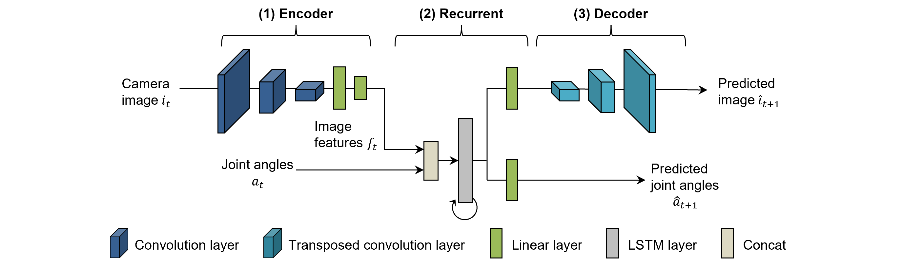
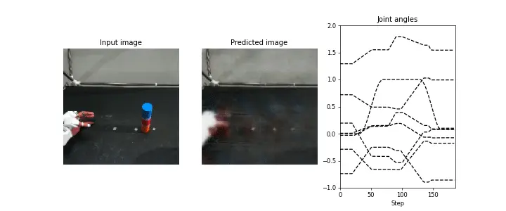
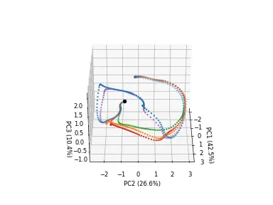

# 概要 {#overview}

CAE-RNNは、画像特徴量抽出部（CAE）と時系列学習部（RNN）を独立して学習させるため、パラメータ調整やモデル学習時間などが課題であった。
さらに、CAEは画像情報の次元圧縮に特化した画像特徴量を抽出しているため、必ずしもロボットの動作生成に適切な画像特徴量であるとは言えない。
そこでCNNRNNは、画像特徴量抽出部（CAE）と時系列学習部（RNN）を同時に学習（End-to-End学習）することで、動作生成に重要な画像特徴量を自動抽出することが可能な動作生成モデルである。
これによりロボットは作業に重要な対象物にのみ着目して動作を生成するため、CAE-RNNと比較して背景変化に対しロバストな動作を生成することが可能である[@ito2020visualization]。

{: .center}


<!-- #################################################################################################### -->
----
## ファイル {#files}
CNNRNNで用いるプログラム一式と、フォルダ構成は以下のとおりである。

- **bin/train.py**：データの読み込み、学習、そしてモデルの保存を行う学習プログラム。
- **bin/test.py**：テストデータ（画像と関節角度）に基づいて毎時刻の動作指令値を予測し、推論結果を可視化するプログラム。
- **bin/test_pca_cnnrnn.py**：主成分分析を用いてRNNの内部状態を可視化するプログラム。
- **libs/fullBPTT.py**：時系列学習のための誤差逆伝播クラス。
- **log**：学習結果として重みや学習曲線、パラメータの情報を保存。
- **output**：推論結果を保存。


<!-- #################################################################################################### -->
----
## CNNRNNモデル {#model}
CNNRNNは、マルチモーダルな時系列データの学習と推論が可能なニューラルネットワークであり、時刻$t$における画像`xi`、関節角度`xv`そして前時刻での状態`state`に基づいて、次時刻$t+1$の画像`y_image`と関節角度`y_joint`を予測する。

```python title="<a href=https://github.com/ogata-lab/eipl/blob/master/eipl/model/CNNRNN.py>[SOURCE] CNNRNN.py</a>" linenums="1"
class CNNRNN(nn.Module):
    def __init__(self, rec_dim=50, joint_dim=8, feat_dim=10):
        super(CNNRNN, self).__init__()

        # Encoder
        self.encoder_image = nn.Sequential(
            nn.Conv2d(3, 64, 3, 2, 1),
            nn.Tanh(),
            nn.Conv2d(64, 32, 3, 2, 1),
            nn.Tanh(),
            nn.Conv2d(32, 16, 3, 2, 1),
            nn.Tanh(),
            nn.Conv2d(16, 12, 3, 2, 1),
            nn.Tanh(),
            nn.Conv2d(12, 8, 3, 2, 1),
            nn.Tanh(),
            nn.Flatten(),
            nn.Linear(8 * 4 * 4, 50),
            nn.Tanh(),
            nn.Linear(50, feat_dim),
            nn.Tanh(),
        )

        # Recurrent
        rec_in = feat_dim + joint_dim
        self.rec = nn.LSTMCell(rec_in, rec_dim)

        # Decoder for joint angle
        self.decoder_joint = nn.Sequential(nn.Linear(rec_dim, joint_dim), nn.Tanh())

        # Decoder for image
        self.decoder_image = nn.Sequential(
            nn.Linear(rec_dim, 8 * 4 * 4),
            nn.Tanh(),
            nn.Unflatten(1, (8, 4, 4)),
            nn.ConvTranspose2d(8, 12, 3, 2, padding=1, output_padding=1),
            nn.Tanh(),
            nn.ConvTranspose2d(12, 16, 3, 2, padding=1, output_padding=1),
            nn.Tanh(),
            nn.ConvTranspose2d(16, 32, 3, 2, padding=1, output_padding=1),
            nn.Tanh(),
            nn.ConvTranspose2d(32, 64, 3, 2, padding=1, output_padding=1),
            nn.Tanh(),
            nn.ConvTranspose2d(64, 3, 3, 2, padding=1, output_padding=1),
            nn.Tanh(),
        )

    def forward(self, xi, xv, state=None):
        # Encoder
        im_feat = self.encoder_image(xi)
        hid = torch.concat([im_feat, xv], -1)

        # Recurrent
        rnn_hid = self.rec(hid, state)

        # Decoder
        y_joint = self.decoder_joint(rnn_hid[0])
        y_image = self.decoder_image(rnn_hid[0])

        return y_image, y_joint, rnn_hid
```


<!-- #################################################################################################### -->
----
## 誤差逆伝播法 {#bptt}
時系列学習を行うための誤差逆伝播アルゴリズムとしてBackpropagation Through Time（BPTT）を用いる。
BPTTの詳細はSARNNで記載済みであるため、そちらを[参照](../../model/SARNN#bptt)されたい。

```python title="<a href=https://github.com/ogata-lab/eipl/blob/master/eipl/zoo/cnnrnn/libs/fullBPTT.py>[SOURCE] fullBPTT.py</a>" linenums="1"
class fullBPTTtrainer:
    def __init__(self, model, optimizer, loss_weights=[1.0, 1.0], device="cpu"):
        self.device = device
        self.optimizer = optimizer
        self.loss_weights = loss_weights
        self.model = model.to(self.device)

    def save(self, epoch, loss, savename):
        torch.save(
            {
                "epoch": epoch,
                "model_state_dict": self.model.state_dict(),
                "train_loss": loss[0],
                "test_loss": loss[1],
            },
            savename,
        )

    def process_epoch(self, data, training=True):
        if not training:
            self.model.eval()

        total_loss = 0.0
        for n_batch, ((x_img, x_joint), (y_img, y_joint)) in enumerate(data):
            x_img = x_img.to(self.device)
            y_img = y_img.to(self.device)
            x_joint = x_joint.to(self.device)
            y_joint = y_joint.to(self.device)

            state = None
            yi_list, yv_list = [], []
            T = x_img.shape[1]
            for t in range(T - 1):
                _yi_hat, _yv_hat, state = self.model(x_img[:, t], x_joint[:, t], state)
                yi_list.append(_yi_hat)
                yv_list.append(_yv_hat)

            yi_hat = torch.permute(torch.stack(yi_list), (1, 0, 2, 3, 4))
            yv_hat = torch.permute(torch.stack(yv_list), (1, 0, 2))
            loss = self.loss_weights[0] * nn.MSELoss()(yi_hat, y_img[:, 1:]) \
                + self.loss_weights[1] * nn.MSELoss()(yv_hat, y_joint[:, 1:])
            total_loss += loss.item()

            if training:
                self.optimizer.zero_grad(set_to_none=True)
                loss.backward()
                self.optimizer.step()

        return total_loss / (n_batch + 1)
```


<!-- #################################################################################################### -->
----
## 学習 {#train}
メインプログラム `train.py` を使用して、CNNRNNを学習する。
プログラムを実行すると `log` フォルダ内に学習済みの重み（pth）とTensorboardのログファイルが保存される。
プログラムの詳細な動作については、コード内のコメントを[参照](https://github.com/ogata-lab/eipl/blob/master/eipl/zoo/cnnrnn/bin/train.py)ください。

```bash
$ cd eipl/zoo/cnnrnn/
$ python3 ./bin/train.py
[INFO] Set tag = 20230514_1958_07
================================
batch_size : 5
device : 0
epoch : 100000
feat_dim : 10
img_loss : 1.0
joint_loss : 1.0
log_dir : log/
lr : 0.001
model : CNNRNN
optimizer : adam
rec_dim : 50
stdev : 0.02
tag : 20230514_1958_07
vmax : 1.0
vmin : 0.0
================================
0%|               | 83/100000 [05:07<99:16:42,  3.58s/it, train_loss=0.0213, test_loss=0.022
```


<!-- #################################################################################################### -->
----
## 推論 {#inference}
CNNRNNが適切に学習されたかを確認するために、テストプログラム `test.py` を用いて検証する。
引数 `filename` は学習済みの重みファイルのパス、 `idx` は可視化したいデータのインデックス、
`input_param` は推論時の混合係数であり、[詳細はこちら](../model/test.md)を参照ください。

```bash
$ cd eipl/zoo/cnnrnn/
$ python3 ./bin/test.py --filename ./log/20230514_1958_07/CNNRNN.pth --idx 4 --input_param 1.0

images shape:(187, 128, 128, 3), min=0, max=255
joints shape:(187, 8), min=-0.8595600128173828, max=1.8292399644851685
loop_ct:0, joint:[ 0.00226304 -0.7357931  -0.28175825  1.2895856   0.7252841   0.14539993
-0.0266939   0.00422328]
loop_ct:1, joint:[ 0.00307412 -0.73363686 -0.2815826   1.2874944   0.72176594  0.1542334
-0.02719587  0.00325996]
.
.
.

$ ls ./output/
CNNRNN_20230514_1958_07_4_1.0.gif
```

下図に、[未学習位置](../teach/overview.md#task)での推論結果を示す。
左から入力画像、予測画像、そして予測関節角度（点線は真値）である。
CNNRNNは抽出した画像特徴量とロボット関節角度に基づいて次時刻のそれらを予測する。
このとき、画像特徴量には把持対象物の色や位置などの情報が含まれていることが期待され、更に予測画像とロボット関節角度がセットで適切に予測されることが重要である。
しかし実験より、関節角度は適切に予測できているのに対し、予測画像にはロボットハンドしか生成されていない。
このことから、画像特徴量にはロボットハンドの情報「しか」含まれていないため、物体位置に応じた柔軟な動作生成は困難である。

{: .center}


<!-- #################################################################################################### -->
----
## 主成分分析 {#pca}
下図は主成分分析を用いてCNNRNNの内部状態を可視化した結果である。
各点線はCNNRNNの内部状態の時系列変化を示しており、黒色丸を始点に逐次内部状態が遷移する。
各アトラクタの色は[物体位置](../teach/overview.md#task)を示しており、青、オレンジ、緑は教示位置A、C、Eに、赤、紫は未学習位置B、Dに対応している。
教示位置ごとにアトラクタが自己組織化（整列）していることから、教示位置では適切に学習した動作が生成できると言える。
一方で未教示位置のアトラクタは、教示位置のアトラクタに引き寄せられていることから、内挿動作を生成することはできない。
これは、把持対象物の位置情報が画像特徴量として抽出できなかったことが原因としてあげられる。

{: .center}


<!-- #################################################################################################### -->
----
## モデル改良 {#improvement}
CAE-RNNでは、データ拡張を用いて多様な物体位置情報を学習させることで汎化性能を担保したが、CNNRNNは画像と関節角度情報を同時に学習させるため、画像と関節角度をセットでデータ拡張する必要があり、画像の位置変化に対応したロボット関節角度のデータ拡張方法課題である。そこで、CNNRNNで位置汎化性能を獲得するための解決策として、以下3つが挙げられる。

1. **事前学習**

    CNNRNNのうち、CAEの部分のみを取り出し事前学習を行う。
    データ拡張を用いて画像情報のみを学習させることで、CAEでは多様な物体位置情報を抽出することが可能になる。
    そして事前学習した重みを用いてEnd-to-End学習を行うことで、画像と関節角度の対応付けを行う。
    しかし、事前にCAEを学習させる必要があるため、CAE-RNNと同等の学習工数が発生するためCNNRNNの恩恵が少ない。
    
2. **正則化：CNNRNN with LayerNorm（CNNRNNLN）**

    CAE-RNNでは、CAEの学習を安定かつ高速に行うために正則化手法として `BatchNormalization`[@ioffe2015batch] を用いた。
    しかし BatchNormalization はデータセットのバッチが小さいと学習が不安定になる、
    再帰的ニューラルネットワークへの適用が困難という課題がある。
    そこで、データセットのバッチが小さく、更に時系列長が変化しても安定して学習が行える
    `Layer Normalization`[@ba2016layer] を用いることで汎化性能向上を実現する。

    下図は主成分分析を用いて[CNNRNNLN](https://github.com/ogata-lab/eipl/blob/master/eipl/model/CNNRNNLN.py)の内部状態を可視化した結果である。
    対象物の位置ごとにアトラクタが自己組織化（整列）していることから、未学習位置でも適切に動作を生成することが可能である。

    {: .center}


3. **空間的注意機構（Spatial Attention）**

    これまで画像中の多様な情報（位置、色、形状、背景、照明状況など）が含まれた画像特徴量に基づいて動作学習が行われていたため、動作生成時のロバスト性が課題であった。
    そこで、画像からタスクに重要な位置（作業対象物やアーム）の空間座標を「明示的」に抽出する空間的注意機構を用いて、空間座標とロボットの関節角度を学習することでロバスト性を向上させることが可能である。
    空間的注意機構の詳細は[こちら](../model/SARNN.md)を参照ください。

