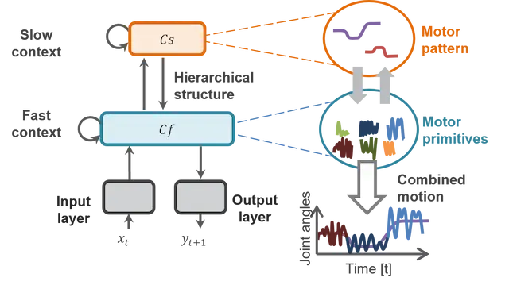

# 概要

MTRNNは、応答速度の異なる階層的なニューロン群から構成されるRNNの一種である[@yamashita2008emergence]。
IO層と異なる発火速度（時定数）を持つコンテキスト層（Cf層とCs層）の3層からなり、それぞれ再帰的な入力を持つ。
時定数は、Cf層からCs層の順で値が大きくなり、入力に対する応答速度が遅くなる。
入力された情報は、Cf層とCs層を介してOutput層で出力される。
IO層とCs層の間に直接の結合は存在せず、Cf層を介して相互作用する。
MTRNNを用いることで、ロボットの動作学習が可能となり、Cf層では動作プリミティブ、Cs層ではそれらの組み合わせが表現（学習）される。
LSTMと比較してMTRNNは解釈性が高いため、尾形研究室でよく用いている。

{: .center}

::: MTRNN.MTRNNCell
    handler: python
    options:
      show_root_heading: true
      show_source: true

::: MTRNN.BasicMTRNN
    handler: python
    options:
      show_root_heading: true
      show_source: true
